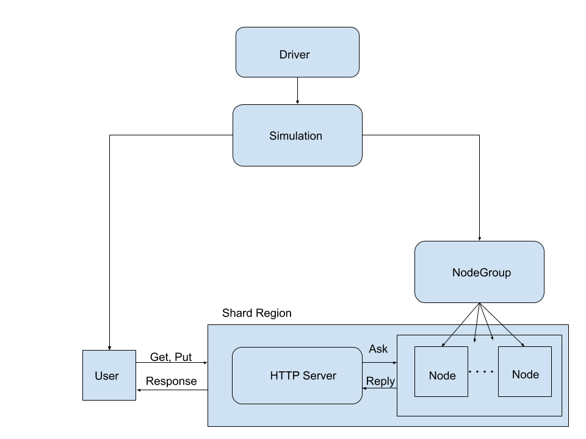
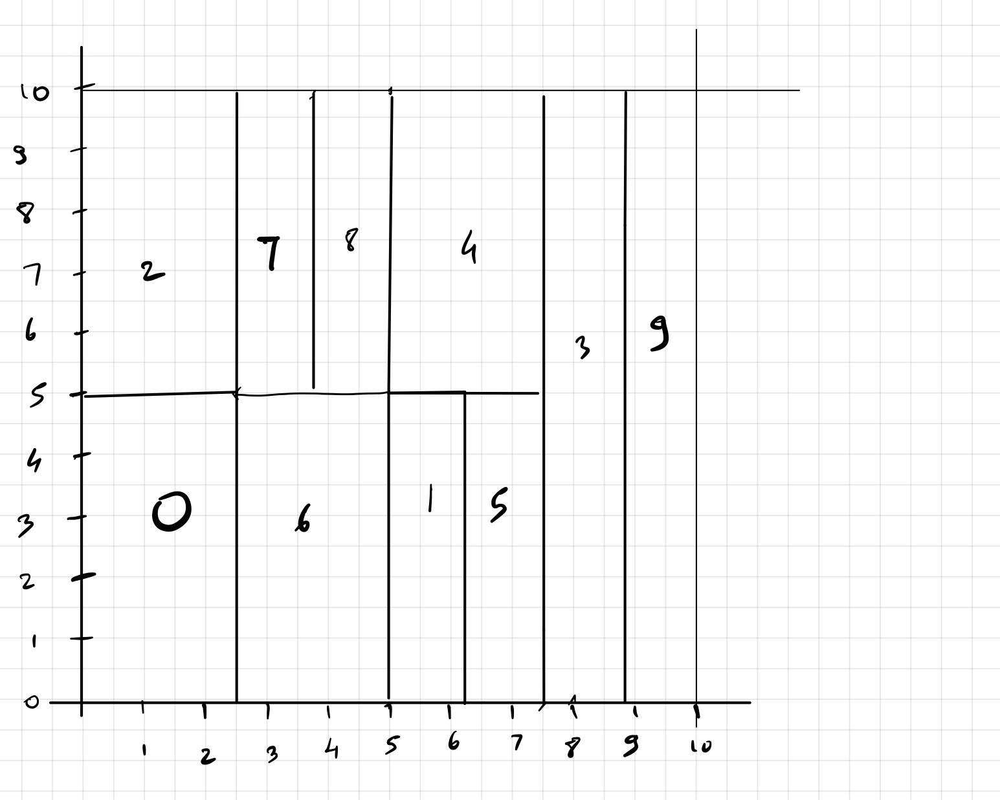

### CS 441 - Project

### Implementations
* [**CAN Implementation**](#markdown-header-project-details-to-create-content-addressable-network-using-typed-akka-and-akka-http-and-cluster-sharding)
* [**Chord Implementation**](README_Chord_Sharding.md)

### Project Details: To create Content-Addressable Network using Typed Akka and Akka-HTTP and Cluster Sharding

#### Project Members: (in Alphabetical Order)
* **Karan Venkatesh Davanam** (Lead)
* Prajwal Kishor Kammardi
* Rishabh Mehta 
* Shabbir Bohra

#### Development Environment
* Development environment: Windows 10
* Frameworks Akka 2.6.10, Akka-HTTP 10.2.1, Akka-Stream 2.6.10, Akka-Cluster-Sharding-typed 2.6.10, Akka-Management 1.0.9
* IDE Used: IntelliJ IDEA 2020.2.3
* Build Tools: SBT
* Deployment tools: Docker


#### Aim
To implement [**A Scalable Content-Addressable Network**](https://people.eecs.berkeley.edu/~sylvia/papers/cans.pdf)

#### Steps to run
1. To run using sbt build tool
    1. Clone the repository [OverlayNetworkSimulator_Group1](https://bitbucket.org/cs441-fall2020/overlaynetworksimulator_group1/)
    `git clone https://prajwalkk@bitbucket.org/cs441-fall2020/overlaynetworksimulator_group1.git`
    Make sure to be on the master branch.
    1. run
        `sbt runMain com.can.akka.CAN_SimulationDriver`
1. To run using docker 
    1. Pull the image from docker hub `docker pull prajwalkk/overlay-sim:1.0` 
    1. `docker run --name overlay_sim_container --rm -i -t prajwalkk/overlay-sim:1.0 /bin/sh`
    1. run `./runCan.sh` inside the docker shell
    1. End the docker session after the program terminates


#### Features of the Project
1. The Project is fully written in Scala
1. The Project fully makes use of Akka-Typed Behaviors model. It may seem to look like it is OO model, but the Actors are modelled in such a way that the Objects represents Protocols used by the actor and the classes use the functions as Behaviors. This style of separation of concerns was suggested by the [style guide](https://doc.akka.io/docs/akka/current/typed/style-guide.html)
1. The Project uses Akka cluster sharding to shard the CAN nodes.
1. Fault tolerance is implemented as LeaveNode and Merge messages
1. Statistics for data lookup and insertion is number of hops required in finding the node responsible for the key   
1. The data used by the Project is a collection of dialogues as keys and their Shakespeare-an conversion. They contain spaces and are encoded before firing a request or sending a response. 

#### Architecture


#### Docker and AWS EC2 Deployment video:
[Project Deployment Video](https://youtu.be/tW1qjYPexvw)

#### Code Flow
* The Project is an attempted Monte Carlo simulation of how a P2P distributed system tends to store the data in the network
It involves the following modules
    * Simulation Driver 
        * Main entry point of the application
        * Creates the NodeActor, User, HTTP server actors
        * Implements the runnable for nodeJoin, nodeLeave, dataLookup and dataInsert which are scheduled according to the intervals defined in the configuration file.
        * Present in the `com.can.akka` package
    * Simulation object
        * The object that contains function to execute the Monte carlo simulation
        * Creates NodeGroup, UserSystem
        * Akka Management and sharding is defined
        * Present in `com.can.akka.simulation` package
    * Node Group. 
        * This module is responsible to hold the information about the node actors in the Akka System.
        * This is an Akka ActorSystem which creates NodeActor.
        * The node group's job is to Create the number of nodes that is specified in the configuration file. 
        * present in the `com.can.akka.actors` package
        * Node Group Behavior.These are messages that NodeGroup can receive
            1. `CreateNode`
                * This message when received by NodeGroup creates an actor of type NodeActor and then calls CAN_Join in NodeActor which inserts this node in the CAN     coordinate space waits for the reply from CAN_Join and then replies with ActionSuccessful message.
    * Node Actor
        * The main Computing component
        * present in`com.can.akka.actors` package
        * Each node implements the functions specified in the can algorithm
        * A node is added to the CAN zone sequentially.
        * While joining the coordinate space , the node's coordinate , neighbours and data are initialized to empty. If it is the first node, whole CAN coordinate space is assigned to this zone
        * Node Operations. They are either messages or functions. The decisions of choosing them to be messages and functions are elaborated below  
            1. `CAN_Join`
                * This is an ask request send my the new joining node and replies when complete.
                * If the node is the first node, it sets its coordinate to whole CAN zone else we generate random X and Y coordinates to decide where the new node will reside.
                * These coordinates are then used to send FindZone message which replies with the node whose zone contain X and Y
                * This node is then split in half either along horizontally or vertically by sending a message SplitZone which replies back with coordinates for the new node and nodes which are neighbours to this new zone.
                * Then the data that has to be transferred from the current node to new node is checked by sending a message UpdateData which replies back with the data to be added to new node.
                * All the properties needed for this new node to join are stored as new node properties and updated.
            2.  `FindZone`
                * This is an ask request that is sent by an existing node when a new node is joining.
                * It finds the node where the new node should reside based on the random coordinates received in the message.
                * Existing node zone is initially checked to verify if the points lie in the existing node zone , if they lie it is returned as a reply or getClosestNeighbour method is called which returns a neighbour of the existing node which is closest to the point , this is repeated till a node is found whose zone contains the random coordinates.
                * **Number of hops** required to find the zone are calculated  
                * Node found and number of hops are then sent back as a reply.
            3.  `SplitZone` 
                * This is an ask request that is sent by an existing node which has to be split to accomodate the new joining zone.
                * We first check how was the existing node split previously based on the flag zoneSplitOnx_update if true it is split vertically else horizontally,this gives the new cooridnates for the current and the new node.
                * Then its neighbours are checked to verify they are still neighbours of the current node with new coordinates ,this is done by calling checkNeighbourstoRemove method which returns negihbours to remove from current node and neighbours to add to new node.
                * These returned neighbours need to add a new node as their neighbour this is done by a tell message UpdateNeighbour from neighbour.
                * A new node and existing node add each other as their neighbours.
                * Existing node properties are updated and new node properties are sent as a reply.
            4. `getClosestNeighbour`
                * This a method which finds the closest neighbour to the points x and y received as method parameters.
                * For each neighbour in the list ,its zone is checked to verify it contains points x and y if not then distance from center of zone to points is calculated , and shortest one is returned.
            5. `checkNeighbourstoRemove`
                * This is a method called an existing node that is being split.
                * Neighbour list of the existing node is verified to check if the neighbours are still adjacent to the node.If they dont the neighbour node is notified to remove the current node from its Neighbour list by a tell message RemoveNeighbour.
                * If the neighbour still lies in the new zone it sends a tell message UpdateNeighbour to update the zone of current node in its list.
                * It also checks which of these neighbours are neighbours to the new node.
                * This function returns node_to_remove and neighbours_to_add_to_newNode.
            6. `UpdateData`
                * This is an ask message that is sent by an existing node that is being split.
                * All the data keys are checked if they still lie in the updated zone of the exisiting node.
                * Data that does not any more lie in the updated zone is sent back as an reply.
                * Existing node properties are updated.
            7. `LeaveNode`
                * This is a tell message that is called by an node that is leaving the CAN coordinate system.
                * **Fault tolerance** is implemented in this message.
                * Before the node leaves it needs to handover its neighbours and data to its neighbour that can merge with its zone.Such neighbour is found using findMergeNode function.
                * The coordinates are merged using mergeCoordinate function.
                * If the findMergeNode returns a node we merge or this node cannot leave as it did not find a neighbour to merge ,this happens if none of its neighbours are of the same size as the leaving node.
                * All the data and neighbours  are handed over the merging node , to update this merge node another message Merge is called by the merging node.
            8. `Merge`
                * This is a tell message that is called by the node merging with a leaving node.
                * Here UpdateNeighbours message is sent by each of the old neighbours and new neighbours to update the zone of this new node.
                * New properties after merge are updated.
            9. `findMergeNode` 
                * This function searches the neighbours of a node that are of the same size of the node.
                * If multiple such neighbours are found the closest to the node is returned.
                * If none are found None is returned by the function.
            10. `FindNode`
                * This is an ask request sent by Http server to find a node to insert the data.
                * Data key is hashed using two different hashing algorithms SHA-1 and MD5 to get a random point on the coordinate plane.
                * Then a random node is selected which sends a message FindZone to search which node's zone contains the hashed data key coordinates.
                * Once the node is received from FindZone data key and value is inserted into that node using addValue ask request.
                * Reply is sent by to Http server that data is inserted.
            11. `SearchDataNode`
                * This is an ask request sent by Http server to find a node to lookup data.
                * Data key is hashed similarly as in FindNode, and a random node is used to send message FindZone , which returns the node whose zone contains the key.
                * Data is searched at that node using getValue ask request  if data is found the value is returned else Data not found is sent by as an reply.
    * User Actor
        * It models a user who can:
            1. `lookup_data` Search for the inserted keys 
            2. `put_data` Insert data to the system
      * present in the `com.can.akka.actors` package
    * HTTP Server
        * This orchestrates the message from the user to the node component.
        * present in the `com.can.akka.webserver` package
        * Set on `localhost:8080` the path are `/can`.
        * HTTP routes are defined in CANRoutes.lookuproutes
        * The get request for `global_system_state` is like `http://127.0.0.1:8000/can`
        * The get request for `lookup_data` is like `http://127.0.0.1:8000/can/<key>`
        * the post request for `put_data` is like `http://127.0.0.1:8000/can` and a json payload `{"key":"$key","value":"$value"}`
    * Utils
        * The Utils package contains classes to perform operations
        * present in the `com.can.akka.utils` package 
            1. `DataUtils` read_data() of a CSV file
            2. `Helper` Contains hashing functions (SHA1), and function to get random X and Y coordinates.
            3. `Neighbour` case class defines the structure of how an neighbour is stored.
            4. `Coordinate` case class defines the structure of how an coordinates is stored.
            
            
#### Execution Sample 


#### Results
* CAN coordinate space after inserting 10 nodes



* The server addition logs are as below: 

```log
[2020-12-10 05:24:19,381] [INFO]  - ********************* Simulation Start **********************
[2020-12-10 05:24:21,080] [INFO]  - Slf4jLogger started
[2020-12-10 05:24:22,212] [INFO]  - Remoting started with transport [Artery tcp]; listening on address [akka://NodeActorSystem@127.0.0.1:2551] with UID [-7766242290585109677]
[2020-12-10 05:24:22,304] [INFO]  - Cluster Node [akka://NodeActorSystem@127.0.0.1:2551] - Starting up, Akka version [2.6.10] ...
[2020-12-10 05:24:22,865] [INFO]  - Cluster Node [akka://NodeActorSystem@127.0.0.1:2551] - Registered cluster JMX MBean [akka:type=Cluster,port=2551]
[2020-12-10 05:24:22,867] [INFO]  - Cluster Node [akka://NodeActorSystem@127.0.0.1:2551] - Started up successfully
[2020-12-10 05:24:23,046] [INFO]  - Cluster Node [akka://NodeActorSystem@127.0.0.1:2551] - No downing-provider-class configured, manual cluster downing required, see https://doc.akka.io/docs/akka/current/typed/cluster.html#downing
[2020-12-10 05:24:23,080] [INFO]  - Cluster Node [akka://NodeActorSystem@127.0.0.1:2551] - Node [akka://NodeActorSystem@127.0.0.1:2551] is JOINING itself (with roles [dc-default], version [0.0.0]) and forming new cluster
[2020-12-10 05:24:23,087] [INFO]  - Cluster Node [akka://NodeActorSystem@127.0.0.1:2551] - is the new leader among reachable nodes (more leaders may exist)
[2020-12-10 05:24:23,113] [INFO]  - Cluster Node [akka://NodeActorSystem@127.0.0.1:2551] - Leader is moving node [akka://NodeActorSystem@127.0.0.1:2551] to [Up]
[2020-12-10 05:24:25,201] [INFO]  - Loading readiness checks [(cluster-membership,akka.management.cluster.scaladsl.ClusterMembershipCheck), (sharding,akka.cluster.sharding.ClusterShardingHealthCheck)]
[2020-12-10 05:24:25,203] [INFO]  - Loading liveness checks []
[2020-12-10 05:24:25,495] [INFO]  - Binding Akka Management (HTTP) endpoint to: 127.0.0.1:8558
[2020-12-10 05:24:25,768] [INFO]  - Including HTTP management routes for ClusterHttpManagementRouteProvider
[2020-12-10 05:24:25,883] [INFO]  - Including HTTP management routes for HealthCheckRoutes
[2020-12-10 05:24:27,348] [INFO]  - Bound Akka Management (HTTP) endpoint to: 127.0.0.1:8558
[2020-12-10 05:24:27,377] [INFO]  - Starting Shard Region [NodeActor]...
[2020-12-10 05:24:27,467] [INFO]  - Slf4jLogger started
[2020-12-10 05:24:27,468] [INFO]  - Singleton manager starting singleton actor [akka://NodeActorSystem/system/sharding/NodeActorCoordinator/singleton]
[2020-12-10 05:24:27,472] [INFO]  - ClusterSingletonManager state change [Start -> Oldest]
[2020-12-10 05:24:27,514] [INFO]  - NodeActor: ShardCoordinator was moved to the active state State(Map())
[2020-12-10 05:24:27,821] [INFO]  - [CAN_Join] CAN Zone created with coordinates (0,0) and (10,10)
[2020-12-10 05:24:27,821] [INFO]  - [CAN_Join] First Node Joining node_0
[2020-12-10 05:24:27,822] [INFO]  - [CAN_Join] node_0 assigned to zone with coordinates (0,0) and (10,10)
[2020-12-10 05:24:27,837] [INFO]  - [CreateNode] EntityRef(EntityTypeKey[com.can.akka.actors.NodeActor$Command](NodeActor), node_0) joined 
[2020-12-10 05:24:27,841] [INFO]  - [CAN_Join] Node Joining node_1 with EntityRef(EntityTypeKey[com.can.akka.actors.NodeActor$Command](NodeActor), node_0)
[2020-12-10 05:24:28,005] [INFO]  - [CAN_Join] splitting EntityRef(EntityTypeKey[com.can.akka.actors.NodeActor$Command](NodeActor), node_0) zone to accommodate node_1 Node
[2020-12-10 05:24:28,007] [INFO]  - [SplitZone] Splitting node_0 Zone vertically 
[2020-12-10 05:24:28,011] [INFO]  - Checking data of the split node EntityRef(EntityTypeKey[com.can.akka.actors.NodeActor$Command](NodeActor), node_0) to transfer to new node 
[2020-12-10 05:24:28,012] [INFO]  - [SplitZone] node_0 Coordinates Updated after Split 
NodeName :node_0
, Path = EntityRef(EntityTypeKey[com.can.akka.actors.NodeActor$Command](NodeActor), node_0)
, Coordinates = Some(Bottom Left (0.0,0.0) Top Right (5.0,10.0)) 
, Neighbours = List(Neighbour(Bottom Left (5.0,0.0) Top Right (10.0,10.0),EntityRef(EntityTypeKey[com.can.akka.actors.NodeActor$Command](NodeActor), node_1)))
[2020-12-10 05:24:28,014] [INFO]  - No Data Transfer Required from node_0
[2020-12-10 05:24:28,030] [INFO]  - [CAN_Join] node_1 Updated after Join 
NodeName :node_1
, Path = EntityRef(EntityTypeKey[com.can.akka.actors.NodeActor$Command](NodeActor), node_1)
, Coordinates = Some(Bottom Left (5.0,0.0) Top Right (10.0,10.0)) 
, Neighbours = List(Neighbour(Bottom Left (0.0,0.0) Top Right (5.0,10.0),EntityRef(EntityTypeKey[com.can.akka.actors.NodeActor$Command](NodeActor), node_0)))
```
* User creation logs are as below:

```log
User Created akka://UserSystem/user/User_afddd6dd-67e3-4e57-8733-ce5e96bf9423
``` 
* HTTP: Server Creation and data insertion log:

```log
HTTPServer online at http://127.0.0.1:8000/
[2020-12-10 05:24:45,353] [INFO]  - Inserting 50 records
[2020-12-10 05:24:45,353] [INFO]  - Initializing CAN data
[2020-12-10 05:24:45,714] [INFO]  - [FindNode] Inserting data with key (2.0,6.0) at EntityRef(EntityTypeKey[com.can.akka.actors.NodeActor$Command](NodeActor), node_9) node
[2020-12-10 05:24:45,752] [INFO]  - [FindNode] [addValue]Data inserted at EntityRef(EntityTypeKey[com.can.akka.actors.NodeActor$Command](NodeActor), node_9) with key datakey and value Excellent well. in hops :2
[2020-12-10 05:24:46,373] [INFO]  - [FindNode] Inserting data with key (10.0,6.0) at EntityRef(EntityTypeKey[com.can.akka.actors.NodeActor$Command](NodeActor), node_2) node
[2020-12-10 05:24:46,374] [INFO]  - [FindNode] [addValue]Data inserted at EntityRef(EntityTypeKey[com.can.akka.actors.NodeActor$Command](NodeActor), node_2) with key datakey and value You are a fishmonger. in hops :1
[2020-12-10 05:24:47,378] [INFO]  - [FindNode] Inserting data with key (3.0,10.0) at EntityRef(EntityTypeKey[com.can.akka.actors.NodeActor$Command](NodeActor), node_3) node
[2020-12-10 05:24:47,379] [INFO]  - [FindNode] [addValue]Data inserted at EntityRef(EntityTypeKey[com.can.akka.actors.NodeActor$Command](NodeActor), node_3) with key datakey and value Not I, my lord. in hops :2
[2020-12-10 05:24:48,398] [INFO]  - [FindNode] Inserting data with key (8.0,10.0) at EntityRef(EntityTypeKey[com.can.akka.actors.NodeActor$Command](NodeActor), node_2) node
[2020-12-10 05:24:48,401] [INFO]  - [FindNode] [addValue]Data inserted at EntityRef(EntityTypeKey[com.can.akka.actors.NodeActor$Command](NodeActor), node_2) with key datakey and value Then I would you were so honest a man. in hops :2
[2020-12-10 05:24:49,401] [INFO]  - [FindNode] Inserting data with key (4.0,6.0) at EntityRef(EntityTypeKey[com.can.akka.actors.NodeActor$Command](NodeActor), node_3) node
[2020-12-10 05:24:49,401] [INFO]  - [FindNode] [addValue]Data inserted at EntityRef(EntityTypeKey[com.can.akka.actors.NodeActor$Command](NodeActor), node_3) with key datakey and value Honest, my lord? in hops :2
[2020-12-10 05:24:50,414] [INFO]  - [FindNode] Inserting data with key (7.0,10.0) at EntityRef(EntityTypeKey[com.can.akka.actors.NodeActor$Command](NodeActor), node_5) node
[2020-12-10 05:24:50,415] [INFO]  - [FindNode] [addValue]Data inserted at EntityRef(EntityTypeKey[com.can.akka.actors.NodeActor$Command](NodeActor), node_5) with key datakey and value Ay, sir. in hops :2
[2020-12-10 05:24:51,423] [INFO]  - [FindNode] Inserting data with key (9.0,7.0) at EntityRef(EntityTypeKey[com.can.akka.actors.NodeActor$Command](NodeActor), node_2) node
[2020-12-10 05:24:51,424] [INFO]  - [FindNode] [addValue]Data inserted at EntityRef(EntityTypeKey[com.can.akka.actors.NodeActor$Command](NodeActor), node_2) with key datakey and value To be honest, as this world goes, is to be one man picked out of ten thousand. in hops :8
[2020-12-10 05:24:52,439] [INFO]  - [FindNode] Inserting data with key (9.0,8.0) at EntityRef(EntityTypeKey[com.can.akka.actors.NodeActor$Command](NodeActor), node_2) node
[2020-12-10 05:24:52,442] [INFO]  - [FindNode] [addValue]Data inserted at EntityRef(EntityTypeKey[com.can.akka.actors.NodeActor$Command](NodeActor), node_2) with key datakey and value That’s very true, my lord. in hops :8
..........
[2020-12-10 05:25:32,739] [INFO]  - [FindNode] Inserting data with key (0.0,2.0) at EntityRef(EntityTypeKey[com.can.akka.actors.NodeActor$Command](NodeActor), node_0) node
[2020-12-10 05:25:32,741] [INFO]  - [FindNode] [addValue]Data inserted at EntityRef(EntityTypeKey[com.can.akka.actors.NodeActor$Command](NodeActor), node_0) with key datakey and value Which dreams indeed are ambition, for the very substance of the ambitious is merely the shadow of a dream. in hops :2
[2020-12-10 05:25:33,736] [INFO]  - [FindNode] Inserting data with key (7.0,9.0) at EntityRef(EntityTypeKey[com.can.akka.actors.NodeActor$Command](NodeActor), node_5) node
[2020-12-10 05:25:33,737] [INFO]  - [FindNode] [addValue]Data inserted at EntityRef(EntityTypeKey[com.can.akka.actors.NodeActor$Command](NodeActor), node_5) with key datakey and value A dream itself is but a shadow. in hops :2
[2020-12-10 05:25:34,755] [INFO]  - [FindNode] Inserting data with key (1.0,0.0) at EntityRef(EntityTypeKey[com.can.akka.actors.NodeActor$Command](NodeActor), node_0) node
[2020-12-10 05:25:34,757] [INFO]  - [FindNode] [addValue]Data inserted at EntityRef(EntityTypeKey[com.can.akka.actors.NodeActor$Command](NodeActor), node_0) with key datakey and value Truly, and I hold ambition of so airy and light a quality that it is but a shadow’s shadow. in hops :1
[2020-12-10 05:25:35,761] [INFO]  - Finished Init data
```

* Random lookup and insert requests scheduled to generate every 15 seconds.

```log
[2020-12-10 05:25:55,793] [INFO]  - [SearchDataNode] Finding node Zone in which the (6.0,3.0) lie
[2020-12-10 05:25:55,795] [INFO]  - [SearchDataNode] Looking up data with key (6.0,3.0) at EntityRef(EntityTypeKey[com.can.akka.actors.NodeActor$Command](NodeActor), node_1) node
[2020-12-10 05:25:55,910] [INFO]  - GetLookupResponse(Some(LookupObject([getValue]  Data found at node_1 key: Good-bye, my lord. ; value : Fare you well, my lord. ))) in hops :4

[2020-12-10 05:26:00,791] [INFO]  - [FindNode] Inserting data with key (6.0,6.0) at EntityRef(EntityTypeKey[com.can.akka.actors.NodeActor$Command](NodeActor), node_14) node
[2020-12-10 05:26:00,792] [INFO]  - [FindNode] [addValue]Data inserted at EntityRef(EntityTypeKey[com.can.akka.actors.NodeActor$Command](NodeActor), node_14) with key datakey and value These are now the fashion, and so berattle the common stages—so they call them—that many wearing rapiers are afraid of goose quills and dare scarce come thither. in hops :2
```

* Node Join scheduled to create a node every 10 seconds

```log
[2020-12-10 05:26:15,784] [INFO]  - [CAN_Join] Node Joining node_16 with EntityRef(EntityTypeKey[com.can.akka.actors.NodeActor$Command](NodeActor), node_0)
[2020-12-10 05:26:15,786] [INFO]  - [CAN_Join] splitting EntityRef(EntityTypeKey[com.can.akka.actors.NodeActor$Command](NodeActor), node_1) zone to accommodate node_16 Node
[2020-12-10 05:26:15,787] [INFO]  - [SplitZone] Splitting node_1 Zone Horizontally 
[2020-12-10 05:26:15,787] [INFO]  - [checkNeighbourstoRemove] removing EntityRef(EntityTypeKey[com.can.akka.actors.NodeActor$Command](NodeActor), node_14) as Neighbour from EntityRef(EntityTypeKey[com.can.akka.actors.NodeActor$Command](NodeActor), node_1)
[2020-12-10 05:26:15,788] [INFO]  - [checkNeighbourstoRemove] Notifying EntityRef(EntityTypeKey[com.can.akka.actors.NodeActor$Command](NodeActor), node_14) to remove EntityRef(EntityTypeKey[com.can.akka.actors.NodeActor$Command](NodeActor), node_1) as neighbour
[2020-12-10 05:26:15,788] [INFO]  - [RemoveNeighbour] Removing EntityRef(EntityTypeKey[com.can.akka.actors.NodeActor$Command](NodeActor), node_1) as neighbour to node_14
[2020-12-10 05:26:15,788] [INFO]  - [RemoveNeighbour] updated node_14 
NodeName :node_14
, Path = EntityRef(EntityTypeKey[com.can.akka.actors.NodeActor$Command](NodeActor), node_14)
, Coordinates = Some(Bottom Left (5.0,5.0) Top Right (6.25,7.5)) 
, Neighbours = List(Neighbour(Bottom Left (5.0,5.0) Top Right (5.625,7.5),EntityRef(EntityTypeKey[com.can.akka.actors.NodeActor$Command](NodeActor), node_5)), Neighbour(Bottom Left (2.5,5.0) Top Right (5.0,10.0),EntityRef(EntityTypeKey[com.can.akka.actors.NodeActor$Command](NodeActor), node_4)), Neighbour(Bottom Left (1.25,5.0) Top Right (2.5,7.5),EntityRef(EntityTypeKey[com.can.akka.actors.NodeActor$Command](NodeActor), node_9)), Neighbour(Bottom Left (6.25,0.0) Top Right (7.5,5.0),EntityRef(EntityTypeKey[com.can.akka.actors.NodeActor$Command](NodeActor), node_10)), Neighbour(Bottom Left (5.0,0.0) Top Right (7.5,5.0),EntityRef(EntityTypeKey[com.can.akka.actors.NodeActor$Command](NodeActor), node_1)), Neighbour(Bottom Left (0.0,0.0) Top Right (5.0,10.0),EntityRef(EntityTypeKey[com.can.akka.actors.NodeActor$Command](NodeActor), node_0)), Neighbour(Bottom Left (6.25,5.0) Top Right (7.5,10.0),EntityRef(EntityTypeKey[com.can.akka.actors.NodeActor$Command](NodeActor), node_6)), Neighbour(Bottom Left (0.0,5.0) Top Right (5.0,10.0),EntityRef(EntityTypeKey[com.can.akka.actors.NodeActor$Command](NodeActor), node_3)), Neighbour(Bottom Left (5.0,7.5) Top Right (6.25,10.0),EntityRef(EntityTypeKey[com.can.akka.actors.NodeActor$Command](NodeActor), node_8)))

[2020-12-10 05:26:15,891] [INFO]  - [checkNeighbourstoRemove] updating EntityRef(EntityTypeKey[com.can.akka.actors.NodeActor$Command](NodeActor), node_10)'s neighbours with new zone after split of EntityRef(EntityTypeKey[com.can.akka.actors.NodeActor$Command](NodeActor), node_1)
[2020-12-10 05:26:15,891] [INFO]  - [UpdateNeighbour] Updating EntityRef(EntityTypeKey[com.can.akka.actors.NodeActor$Command](NodeActor), node_1) zone in node_10
[2020-12-10 05:26:15,891] [INFO]  - [UpdateNeighbour] updated node_10 
NodeName :node_10
, Path = EntityRef(EntityTypeKey[com.can.akka.actors.NodeActor$Command](NodeActor), node_10)
, Coordinates = Some(Bottom Left (6.25,0.0) Top Right (7.5,5.0)) 
, Neighbours = List(Neighbour(Bottom Left (5.0,5.0) Top Right (6.25,7.5),EntityRef(EntityTypeKey[com.can.akka.actors.NodeActor$Command](NodeActor), node_14)), Neighbour(Bottom Left (7.5,0.0) Top Right (10.0,10.0),EntityRef(EntityTypeKey[com.can.akka.actors.NodeActor$Command](NodeActor), node_2)), Neighbour(Bottom Left (6.25,5.0) Top Right (7.5,10.0),EntityRef(EntityTypeKey[com.can.akka.actors.NodeActor$Command](NodeActor), node_6)), Neighbour(Bottom Left (5.0,0.0) Top Right (6.25,5.0),EntityRef(EntityTypeKey[com.can.akka.actors.NodeActor$Command](NodeActor), node_1)), Neighbour(Bottom Left (5.625,5.0) Top Right (6.25,7.5),EntityRef(EntityTypeKey[com.can.akka.actors.NodeActor$Command](NodeActor), node_14)), Neighbour(Bottom Left (5.0,0.0) Top Right (6.25,2.5),EntityRef(EntityTypeKey[com.can.akka.actors.NodeActor$Command](NodeActor), node_1)), Neighbour(Bottom Left (5.0,5.0) Top Right (7.5,10.0),EntityRef(EntityTypeKey[com.can.akka.actors.NodeActor$Command](NodeActor), node_5)))
[2020-12-10 05:26:16,001] [INFO]  - [checkNeighbourstoRemove] updating EntityRef(EntityTypeKey[com.can.akka.actors.NodeActor$Command](NodeActor), node_0)'s neighbours with new zone after split of EntityRef(EntityTypeKey[com.can.akka.actors.NodeActor$Command](NodeActor), node_1)
[2020-12-10 05:26:16,001] [INFO]  - [UpdateNeighbour] Updating EntityRef(EntityTypeKey[com.can.akka.actors.NodeActor$Command](NodeActor), node_1) zone in node_0
[2020-12-10 05:26:16,001] [INFO]  - [UpdateNeighbour] updated node_0 
NodeName :node_0
, Path = EntityRef(EntityTypeKey[com.can.akka.actors.NodeActor$Command](NodeActor), node_0)
, Coordinates = Some(Bottom Left (0.0,0.0) Top Right (5.0,5.0)) 
, Neighbours = List(Neighbour(Bottom Left (2.5,5.0) Top Right (5.0,10.0),EntityRef(EntityTypeKey[com.can.akka.actors.NodeActor$Command](NodeActor), node_4)), Neighbour(Bottom Left (5.0,5.0) Top Right (6.25,7.5),EntityRef(EntityTypeKey[com.can.akka.actors.NodeActor$Command](NodeActor), node_14)), Neighbour(Bottom Left (1.25,5.0) Top Right (2.5,7.5),EntityRef(EntityTypeKey[com.can.akka.actors.NodeActor$Command](NodeActor), node_9)), Neighbour(Bottom Left (0.0,5.0) Top Right (5.0,10.0),EntityRef(EntityTypeKey[com.can.akka.actors.NodeActor$Command](NodeActor), node_3)), Neighbour(Bottom Left (5.0,0.0) Top Right (6.25,2.5),EntityRef(EntityTypeKey[com.can.akka.actors.NodeActor$Command](NodeActor), node_1)), Neighbour(Bottom Left (5.0,0.0) Top Right (10.0,10.0),EntityRef(EntityTypeKey[com.can.akka.actors.NodeActor$Command](NodeActor), node_1)), Neighbour(Bottom Left (5.0,5.0) Top Right (7.5,10.0),EntityRef(EntityTypeKey[com.can.akka.actors.NodeActor$Command](NodeActor), node_5)), Neighbour(Bottom Left (5.0,7.5) Top Right (6.25,10.0),EntityRef(EntityTypeKey[com.can.akka.actors.NodeActor$Command](NodeActor), node_8)), Neighbour(Bottom Left (0.625,5.0) Top Right (1.25,6.25),EntityRef(EntityTypeKey[com.can.akka.actors.NodeActor$Command](NodeActor), node_12)), Neighbour(Bottom Left (0.0,5.0) Top Right (0.625,5.625),EntityRef(EntityTypeKey[com.can.akka.actors.NodeActor$Command](NodeActor), node_3)))
[2020-12-10 05:26:16,111] [INFO]  - [checkNeighbourstoRemove] removing EntityRef(EntityTypeKey[com.can.akka.actors.NodeActor$Command](NodeActor), node_14) as Neighbour from EntityRef(EntityTypeKey[com.can.akka.actors.NodeActor$Command](NodeActor), node_1)
[2020-12-10 05:26:16,111] [INFO]  - [checkNeighbourstoRemove] Notifying EntityRef(EntityTypeKey[com.can.akka.actors.NodeActor$Command](NodeActor), node_14) to remove EntityRef(EntityTypeKey[com.can.akka.actors.NodeActor$Command](NodeActor), node_1) as neighbour
[2020-12-10 05:26:16,111] [INFO]  - [RemoveNeighbour] Removing EntityRef(EntityTypeKey[com.can.akka.actors.NodeActor$Command](NodeActor), node_1) as neighbour to node_14
[2020-12-10 05:26:16,112] [INFO]  - [RemoveNeighbour] updated node_14 
NodeName :node_14
, Path = EntityRef(EntityTypeKey[com.can.akka.actors.NodeActor$Command](NodeActor), node_14)
, Coordinates = Some(Bottom Left (5.0,5.0) Top Right (6.25,7.5)) 
, Neighbours = List(Neighbour(Bottom Left (5.0,5.0) Top Right (5.625,7.5),EntityRef(EntityTypeKey[com.can.akka.actors.NodeActor$Command](NodeActor), node_5)), Neighbour(Bottom Left (2.5,5.0) Top Right (5.0,10.0),EntityRef(EntityTypeKey[com.can.akka.actors.NodeActor$Command](NodeActor), node_4)), Neighbour(Bottom Left (1.25,5.0) Top Right (2.5,7.5),EntityRef(EntityTypeKey[com.can.akka.actors.NodeActor$Command](NodeActor), node_9)), Neighbour(Bottom Left (6.25,0.0) Top Right (7.5,5.0),EntityRef(EntityTypeKey[com.can.akka.actors.NodeActor$Command](NodeActor), node_10)), Neighbour(Bottom Left (5.0,0.0) Top Right (7.5,5.0),EntityRef(EntityTypeKey[com.can.akka.actors.NodeActor$Command](NodeActor), node_1)), Neighbour(Bottom Left (0.0,0.0) Top Right (5.0,10.0),EntityRef(EntityTypeKey[com.can.akka.actors.NodeActor$Command](NodeActor), node_0)), Neighbour(Bottom Left (6.25,5.0) Top Right (7.5,10.0),EntityRef(EntityTypeKey[com.can.akka.actors.NodeActor$Command](NodeActor), node_6)), Neighbour(Bottom Left (0.0,5.0) Top Right (5.0,10.0),EntityRef(EntityTypeKey[com.can.akka.actors.NodeActor$Command](NodeActor), node_3)), Neighbour(Bottom Left (5.0,7.5) Top Right (6.25,10.0),EntityRef(EntityTypeKey[com.can.akka.actors.NodeActor$Command](NodeActor), node_8)))
[2020-12-10 05:26:16,220] [INFO]  - [checkNeighbourstoRemove] removing EntityRef(EntityTypeKey[com.can.akka.actors.NodeActor$Command](NodeActor), node_5) as Neighbour from EntityRef(EntityTypeKey[com.can.akka.actors.NodeActor$Command](NodeActor), node_1)
[2020-12-10 05:26:16,220] [INFO]  - [checkNeighbourstoRemove] Notifying EntityRef(EntityTypeKey[com.can.akka.actors.NodeActor$Command](NodeActor), node_5) to remove EntityRef(EntityTypeKey[com.can.akka.actors.NodeActor$Command](NodeActor), node_1) as neighbour
[2020-12-10 05:26:16,220] [INFO]  - [RemoveNeighbour] Removing EntityRef(EntityTypeKey[com.can.akka.actors.NodeActor$Command](NodeActor), node_1) as neighbour to node_5
[2020-12-10 05:26:16,220] [INFO]  - [RemoveNeighbour] updated node_5 
NodeName :node_5
, Path = EntityRef(EntityTypeKey[com.can.akka.actors.NodeActor$Command](NodeActor), node_5)
, Coordinates = Some(Bottom Left (5.0,5.0) Top Right (5.625,7.5)) 
, Neighbours = List(Neighbour(Bottom Left (2.5,5.0) Top Right (5.0,10.0),EntityRef(EntityTypeKey[com.can.akka.actors.NodeActor$Command](NodeActor), node_4)), Neighbour(Bottom Left (5.0,5.0) Top Right (6.25,7.5),EntityRef(EntityTypeKey[com.can.akka.actors.NodeActor$Command](NodeActor), node_14)), Neighbour(Bottom Left (5.0,0.0) Top Right (7.5,5.0),EntityRef(EntityTypeKey[com.can.akka.actors.NodeActor$Command](NodeActor), node_1)), Neighbour(Bottom Left (0.0,0.0) Top Right (5.0,10.0),EntityRef(EntityTypeKey[com.can.akka.actors.NodeActor$Command](NodeActor), node_0)), Neighbour(Bottom Left (0.0,5.0) Top Right (5.0,10.0),EntityRef(EntityTypeKey[com.can.akka.actors.NodeActor$Command](NodeActor), node_3)), Neighbour(Bottom Left (5.0,7.5) Top Right (6.25,10.0),EntityRef(EntityTypeKey[com.can.akka.actors.NodeActor$Command](NodeActor), node_8)))
[2020-12-10 05:26:16,329] [INFO]  - [checkNeighbourstoRemove] updating EntityRef(EntityTypeKey[com.can.akka.actors.NodeActor$Command](NodeActor), node_0)'s neighbours with new zone after split of EntityRef(EntityTypeKey[com.can.akka.actors.NodeActor$Command](NodeActor), node_1)
[2020-12-10 05:26:16,330] [INFO]  - [UpdateNeighbour] Updating EntityRef(EntityTypeKey[com.can.akka.actors.NodeActor$Command](NodeActor), node_1) zone in node_0
[2020-12-10 05:26:16,330] [INFO]  - [UpdateNeighbour] updated node_0 
NodeName :node_0
, Path = EntityRef(EntityTypeKey[com.can.akka.actors.NodeActor$Command](NodeActor), node_0)
, Coordinates = Some(Bottom Left (0.0,0.0) Top Right (5.0,5.0)) 
, Neighbours = List(Neighbour(Bottom Left (2.5,5.0) Top Right (5.0,10.0),EntityRef(EntityTypeKey[com.can.akka.actors.NodeActor$Command](NodeActor), node_4)), Neighbour(Bottom Left (5.0,5.0) Top Right (6.25,7.5),EntityRef(EntityTypeKey[com.can.akka.actors.NodeActor$Command](NodeActor), node_14)), Neighbour(Bottom Left (1.25,5.0) Top Right (2.5,7.5),EntityRef(EntityTypeKey[com.can.akka.actors.NodeActor$Command](NodeActor), node_9)), Neighbour(Bottom Left (0.0,5.0) Top Right (5.0,10.0),EntityRef(EntityTypeKey[com.can.akka.actors.NodeActor$Command](NodeActor), node_3)), Neighbour(Bottom Left (5.0,0.0) Top Right (6.25,2.5),EntityRef(EntityTypeKey[com.can.akka.actors.NodeActor$Command](NodeActor), node_1)), Neighbour(Bottom Left (5.0,0.0) Top Right (10.0,10.0),EntityRef(EntityTypeKey[com.can.akka.actors.NodeActor$Command](NodeActor), node_1)), Neighbour(Bottom Left (5.0,5.0) Top Right (7.5,10.0),EntityRef(EntityTypeKey[com.can.akka.actors.NodeActor$Command](NodeActor), node_5)), Neighbour(Bottom Left (5.0,7.5) Top Right (6.25,10.0),EntityRef(EntityTypeKey[com.can.akka.actors.NodeActor$Command](NodeActor), node_8)), Neighbour(Bottom Left (0.625,5.0) Top Right (1.25,6.25),EntityRef(EntityTypeKey[com.can.akka.actors.NodeActor$Command](NodeActor), node_12)), Neighbour(Bottom Left (0.0,5.0) Top Right (0.625,5.625),EntityRef(EntityTypeKey[com.can.akka.actors.NodeActor$Command](NodeActor), node_3)))
[2020-12-10 05:26:16,442] [INFO]  - [UpdateNeighbour] Updating EntityRef(EntityTypeKey[com.can.akka.actors.NodeActor$Command](NodeActor), node_16) zone in node_14
[2020-12-10 05:26:16,442] [INFO]  - [UpdateNeighbour] Updating EntityRef(EntityTypeKey[com.can.akka.actors.NodeActor$Command](NodeActor), node_16) zone in node_10
[2020-12-10 05:26:16,442] [INFO]  - [UpdateNeighbour] Updating EntityRef(EntityTypeKey[com.can.akka.actors.NodeActor$Command](NodeActor), node_16) zone in node_0
[2020-12-10 05:26:16,442] [INFO]  - [UpdateNeighbour] Updating EntityRef(EntityTypeKey[com.can.akka.actors.NodeActor$Command](NodeActor), node_16) zone in node_5
[2020-12-10 05:26:16,443] [INFO]  - [UpdateNeighbour] updated node_0 
NodeName :node_0
, Path = EntityRef(EntityTypeKey[com.can.akka.actors.NodeActor$Command](NodeActor), node_0)
, Coordinates = Some(Bottom Left (0.0,0.0) Top Right (5.0,5.0)) 
, Neighbours = List(Neighbour(Bottom Left (2.5,5.0) Top Right (5.0,10.0),EntityRef(EntityTypeKey[com.can.akka.actors.NodeActor$Command](NodeActor), node_4)), Neighbour(Bottom Left (5.0,5.0) Top Right (6.25,7.5),EntityRef(EntityTypeKey[com.can.akka.actors.NodeActor$Command](NodeActor), node_14)), Neighbour(Bottom Left (1.25,5.0) Top Right (2.5,7.5),EntityRef(EntityTypeKey[com.can.akka.actors.NodeActor$Command](NodeActor), node_9)), Neighbour(Bottom Left (5.0,2.5) Top Right (6.25,5.0),EntityRef(EntityTypeKey[com.can.akka.actors.NodeActor$Command](NodeActor), node_16)), Neighbour(Bottom Left (0.0,5.0) Top Right (5.0,10.0),EntityRef(EntityTypeKey[com.can.akka.actors.NodeActor$Command](NodeActor), node_3)), Neighbour(Bottom Left (5.0,0.0) Top Right (6.25,2.5),EntityRef(EntityTypeKey[com.can.akka.actors.NodeActor$Command](NodeActor), node_1)), Neighbour(Bottom Left (5.0,0.0) Top Right (10.0,10.0),EntityRef(EntityTypeKey[com.can.akka.actors.NodeActor$Command](NodeActor), node_1)), Neighbour(Bottom Left (5.0,5.0) Top Right (7.5,10.0),EntityRef(EntityTypeKey[com.can.akka.actors.NodeActor$Command](NodeActor), node_5)), Neighbour(Bottom Left (5.0,7.5) Top Right (6.25,10.0),EntityRef(EntityTypeKey[com.can.akka.actors.NodeActor$Command](NodeActor), node_8)), Neighbour(Bottom Left (0.625,5.0) Top Right (1.25,6.25),EntityRef(EntityTypeKey[com.can.akka.actors.NodeActor$Command](NodeActor), node_12)), Neighbour(Bottom Left (0.0,5.0) Top Right (0.625,5.625),EntityRef(EntityTypeKey[com.can.akka.actors.NodeActor$Command](NodeActor), node_3)))
[2020-12-10 05:26:16,443] [INFO]  - [UpdateNeighbour] updated node_14 
NodeName :node_14
, Path = EntityRef(EntityTypeKey[com.can.akka.actors.NodeActor$Command](NodeActor), node_14)
, Coordinates = Some(Bottom Left (5.0,5.0) Top Right (6.25,7.5)) 
, Neighbours = List(Neighbour(Bottom Left (5.0,5.0) Top Right (5.625,7.5),EntityRef(EntityTypeKey[com.can.akka.actors.NodeActor$Command](NodeActor), node_5)), Neighbour(Bottom Left (2.5,5.0) Top Right (5.0,10.0),EntityRef(EntityTypeKey[com.can.akka.actors.NodeActor$Command](NodeActor), node_4)), Neighbour(Bottom Left (1.25,5.0) Top Right (2.5,7.5),EntityRef(EntityTypeKey[com.can.akka.actors.NodeActor$Command](NodeActor), node_9)), Neighbour(Bottom Left (6.25,0.0) Top Right (7.5,5.0),EntityRef(EntityTypeKey[com.can.akka.actors.NodeActor$Command](NodeActor), node_10)), Neighbour(Bottom Left (5.0,0.0) Top Right (7.5,5.0),EntityRef(EntityTypeKey[com.can.akka.actors.NodeActor$Command](NodeActor), node_1)), Neighbour(Bottom Left (0.0,0.0) Top Right (5.0,10.0),EntityRef(EntityTypeKey[com.can.akka.actors.NodeActor$Command](NodeActor), node_0)), Neighbour(Bottom Left (5.0,2.5) Top Right (6.25,5.0),EntityRef(EntityTypeKey[com.can.akka.actors.NodeActor$Command](NodeActor), node_16)), Neighbour(Bottom Left (6.25,5.0) Top Right (7.5,10.0),EntityRef(EntityTypeKey[com.can.akka.actors.NodeActor$Command](NodeActor), node_6)), Neighbour(Bottom Left (0.0,5.0) Top Right (5.0,10.0),EntityRef(EntityTypeKey[com.can.akka.actors.NodeActor$Command](NodeActor), node_3)), Neighbour(Bottom Left (5.0,7.5) Top Right (6.25,10.0),EntityRef(EntityTypeKey[com.can.akka.actors.NodeActor$Command](NodeActor), node_8)))
[2020-12-10 05:26:16,443] [INFO]  - [UpdateNeighbour] updated node_5 
NodeName :node_5
, Path = EntityRef(EntityTypeKey[com.can.akka.actors.NodeActor$Command](NodeActor), node_5)
, Coordinates = Some(Bottom Left (5.0,5.0) Top Right (5.625,7.5)) 
, Neighbours = List(Neighbour(Bottom Left (2.5,5.0) Top Right (5.0,10.0),EntityRef(EntityTypeKey[com.can.akka.actors.NodeActor$Command](NodeActor), node_4)), Neighbour(Bottom Left (5.0,5.0) Top Right (6.25,7.5),EntityRef(EntityTypeKey[com.can.akka.actors.NodeActor$Command](NodeActor), node_14)), Neighbour(Bottom Left (5.0,0.0) Top Right (7.5,5.0),EntityRef(EntityTypeKey[com.can.akka.actors.NodeActor$Command](NodeActor), node_1)), Neighbour(Bottom Left (0.0,0.0) Top Right (5.0,10.0),EntityRef(EntityTypeKey[com.can.akka.actors.NodeActor$Command](NodeActor), node_0)), Neighbour(Bottom Left (5.0,2.5) Top Right (6.25,5.0),EntityRef(EntityTypeKey[com.can.akka.actors.NodeActor$Command](NodeActor), node_16)), Neighbour(Bottom Left (0.0,5.0) Top Right (5.0,10.0),EntityRef(EntityTypeKey[com.can.akka.actors.NodeActor$Command](NodeActor), node_3)), Neighbour(Bottom Left (5.0,7.5) Top Right (6.25,10.0),EntityRef(EntityTypeKey[com.can.akka.actors.NodeActor$Command](NodeActor), node_8)))
[2020-12-10 05:26:16,443] [INFO]  - [UpdateNeighbour] updated node_10 
NodeName :node_10
, Path = EntityRef(EntityTypeKey[com.can.akka.actors.NodeActor$Command](NodeActor), node_10)
, Coordinates = Some(Bottom Left (6.25,0.0) Top Right (7.5,5.0)) 
, Neighbours = List(Neighbour(Bottom Left (5.0,5.0) Top Right (6.25,7.5),EntityRef(EntityTypeKey[com.can.akka.actors.NodeActor$Command](NodeActor), node_14)), Neighbour(Bottom Left (7.5,0.0) Top Right (10.0,10.0),EntityRef(EntityTypeKey[com.can.akka.actors.NodeActor$Command](NodeActor), node_2)), Neighbour(Bottom Left (5.0,2.5) Top Right (6.25,5.0),EntityRef(EntityTypeKey[com.can.akka.actors.NodeActor$Command](NodeActor), node_16)), Neighbour(Bottom Left (6.25,5.0) Top Right (7.5,10.0),EntityRef(EntityTypeKey[com.can.akka.actors.NodeActor$Command](NodeActor), node_6)), Neighbour(Bottom Left (5.0,0.0) Top Right (6.25,5.0),EntityRef(EntityTypeKey[com.can.akka.actors.NodeActor$Command](NodeActor), node_1)), Neighbour(Bottom Left (5.625,5.0) Top Right (6.25,7.5),EntityRef(EntityTypeKey[com.can.akka.actors.NodeActor$Command](NodeActor), node_14)), Neighbour(Bottom Left (5.0,0.0) Top Right (6.25,2.5),EntityRef(EntityTypeKey[com.can.akka.actors.NodeActor$Command](NodeActor), node_1)), Neighbour(Bottom Left (5.0,5.0) Top Right (7.5,10.0),EntityRef(EntityTypeKey[com.can.akka.actors.NodeActor$Command](NodeActor), node_5)))
[2020-12-10 05:26:16,443] [INFO]  - [UpdateNeighbour] Updating EntityRef(EntityTypeKey[com.can.akka.actors.NodeActor$Command](NodeActor), node_16) zone in node_0
[2020-12-10 05:26:16,443] [INFO]  - [UpdateNeighbour] Updating EntityRef(EntityTypeKey[com.can.akka.actors.NodeActor$Command](NodeActor), node_16) zone in node_14
[2020-12-10 05:26:16,443] [INFO]  - [UpdateNeighbour] Updating EntityRef(EntityTypeKey[com.can.akka.actors.NodeActor$Command](NodeActor), node_16) zone in node_5
[2020-12-10 05:26:16,443] [INFO]  - [UpdateNeighbour] updated node_0 
NodeName :node_0
, Path = EntityRef(EntityTypeKey[com.can.akka.actors.NodeActor$Command](NodeActor), node_0)
, Coordinates = Some(Bottom Left (0.0,0.0) Top Right (5.0,5.0)) 
, Neighbours = List(Neighbour(Bottom Left (2.5,5.0) Top Right (5.0,10.0),EntityRef(EntityTypeKey[com.can.akka.actors.NodeActor$Command](NodeActor), node_4)), Neighbour(Bottom Left (5.0,5.0) Top Right (6.25,7.5),EntityRef(EntityTypeKey[com.can.akka.actors.NodeActor$Command](NodeActor), node_14)), Neighbour(Bottom Left (1.25,5.0) Top Right (2.5,7.5),EntityRef(EntityTypeKey[com.can.akka.actors.NodeActor$Command](NodeActor), node_9)), Neighbour(Bottom Left (5.0,2.5) Top Right (6.25,5.0),EntityRef(EntityTypeKey[com.can.akka.actors.NodeActor$Command](NodeActor), node_16)), Neighbour(Bottom Left (0.0,5.0) Top Right (5.0,10.0),EntityRef(EntityTypeKey[com.can.akka.actors.NodeActor$Command](NodeActor), node_3)), Neighbour(Bottom Left (5.0,0.0) Top Right (6.25,2.5),EntityRef(EntityTypeKey[com.can.akka.actors.NodeActor$Command](NodeActor), node_1)), Neighbour(Bottom Left (5.0,0.0) Top Right (10.0,10.0),EntityRef(EntityTypeKey[com.can.akka.actors.NodeActor$Command](NodeActor), node_1)), Neighbour(Bottom Left (5.0,5.0) Top Right (7.5,10.0),EntityRef(EntityTypeKey[com.can.akka.actors.NodeActor$Command](NodeActor), node_5)), Neighbour(Bottom Left (5.0,7.5) Top Right (6.25,10.0),EntityRef(EntityTypeKey[com.can.akka.actors.NodeActor$Command](NodeActor), node_8)), Neighbour(Bottom Left (0.625,5.0) Top Right (1.25,6.25),EntityRef(EntityTypeKey[com.can.akka.actors.NodeActor$Command](NodeActor), node_12)), Neighbour(Bottom Left (0.0,5.0) Top Right (0.625,5.625),EntityRef(EntityTypeKey[com.can.akka.actors.NodeActor$Command](NodeActor), node_3)))
[2020-12-10 05:26:16,443] [INFO]  - [UpdateNeighbour] updated node_14 
NodeName :node_14
, Path = EntityRef(EntityTypeKey[com.can.akka.actors.NodeActor$Command](NodeActor), node_14)
, Coordinates = Some(Bottom Left (5.0,5.0) Top Right (6.25,7.5)) 
, Neighbours = List(Neighbour(Bottom Left (5.0,5.0) Top Right (5.625,7.5),EntityRef(EntityTypeKey[com.can.akka.actors.NodeActor$Command](NodeActor), node_5)), Neighbour(Bottom Left (2.5,5.0) Top Right (5.0,10.0),EntityRef(EntityTypeKey[com.can.akka.actors.NodeActor$Command](NodeActor), node_4)), Neighbour(Bottom Left (1.25,5.0) Top Right (2.5,7.5),EntityRef(EntityTypeKey[com.can.akka.actors.NodeActor$Command](NodeActor), node_9)), Neighbour(Bottom Left (6.25,0.0) Top Right (7.5,5.0),EntityRef(EntityTypeKey[com.can.akka.actors.NodeActor$Command](NodeActor), node_10)), Neighbour(Bottom Left (5.0,0.0) Top Right (7.5,5.0),EntityRef(EntityTypeKey[com.can.akka.actors.NodeActor$Command](NodeActor), node_1)), Neighbour(Bottom Left (0.0,0.0) Top Right (5.0,10.0),EntityRef(EntityTypeKey[com.can.akka.actors.NodeActor$Command](NodeActor), node_0)), Neighbour(Bottom Left (5.0,2.5) Top Right (6.25,5.0),EntityRef(EntityTypeKey[com.can.akka.actors.NodeActor$Command](NodeActor), node_16)), Neighbour(Bottom Left (6.25,5.0) Top Right (7.5,10.0),EntityRef(EntityTypeKey[com.can.akka.actors.NodeActor$Command](NodeActor), node_6)), Neighbour(Bottom Left (0.0,5.0) Top Right (5.0,10.0),EntityRef(EntityTypeKey[com.can.akka.actors.NodeActor$Command](NodeActor), node_3)), Neighbour(Bottom Left (5.0,7.5) Top Right (6.25,10.0),EntityRef(EntityTypeKey[com.can.akka.actors.NodeActor$Command](NodeActor), node_8)))
[2020-12-10 05:26:16,443] [INFO]  - [UpdateNeighbour] updated node_5 
NodeName :node_5
, Path = EntityRef(EntityTypeKey[com.can.akka.actors.NodeActor$Command](NodeActor), node_5)
, Coordinates = Some(Bottom Left (5.0,5.0) Top Right (5.625,7.5)) 
, Neighbours = List(Neighbour(Bottom Left (2.5,5.0) Top Right (5.0,10.0),EntityRef(EntityTypeKey[com.can.akka.actors.NodeActor$Command](NodeActor), node_4)), Neighbour(Bottom Left (5.0,5.0) Top Right (6.25,7.5),EntityRef(EntityTypeKey[com.can.akka.actors.NodeActor$Command](NodeActor), node_14)), Neighbour(Bottom Left (5.0,0.0) Top Right (7.5,5.0),EntityRef(EntityTypeKey[com.can.akka.actors.NodeActor$Command](NodeActor), node_1)), Neighbour(Bottom Left (0.0,0.0) Top Right (5.0,10.0),EntityRef(EntityTypeKey[com.can.akka.actors.NodeActor$Command](NodeActor), node_0)), Neighbour(Bottom Left (5.0,2.5) Top Right (6.25,5.0),EntityRef(EntityTypeKey[com.can.akka.actors.NodeActor$Command](NodeActor), node_16)), Neighbour(Bottom Left (0.0,5.0) Top Right (5.0,10.0),EntityRef(EntityTypeKey[com.can.akka.actors.NodeActor$Command](NodeActor), node_3)), Neighbour(Bottom Left (5.0,7.5) Top Right (6.25,10.0),EntityRef(EntityTypeKey[com.can.akka.actors.NodeActor$Command](NodeActor), node_8)))
[2020-12-10 05:26:16,443] [INFO]  - [UpdateNeighbour] Updating EntityRef(EntityTypeKey[com.can.akka.actors.NodeActor$Command](NodeActor), node_16) zone in node_14
[2020-12-10 05:26:16,443] [INFO]  - [SplitZone] node_1 Coordinates Updated after Split 
NodeName :node_1
, Path = EntityRef(EntityTypeKey[com.can.akka.actors.NodeActor$Command](NodeActor), node_1)
, Coordinates = Some(Bottom Left (5.0,0.0) Top Right (6.25,2.5)) 
, Neighbours = List(Neighbour(Bottom Left (6.25,0.0) Top Right (7.5,5.0),EntityRef(EntityTypeKey[com.can.akka.actors.NodeActor$Command](NodeActor), node_10)), Neighbour(Bottom Left (0.0,0.0) Top Right (5.0,10.0),EntityRef(EntityTypeKey[com.can.akka.actors.NodeActor$Command](NodeActor), node_0)), Neighbour(Bottom Left (5.0,2.5) Top Right (6.25,5.0),EntityRef(EntityTypeKey[com.can.akka.actors.NodeActor$Command](NodeActor), node_16)), Neighbour(Bottom Left (0.0,0.0) Top Right (5.0,5.0),EntityRef(EntityTypeKey[com.can.akka.actors.NodeActor$Command](NodeActor), node_0)))
[2020-12-10 05:26:16,443] [INFO]  - Checking data of the split node EntityRef(EntityTypeKey[com.can.akka.actors.NodeActor$Command](NodeActor), node_1) to transfer to new node 
[2020-12-10 05:26:16,443] [INFO]  - [UpdateNeighbour] updated node_14 
NodeName :node_14
, Path = EntityRef(EntityTypeKey[com.can.akka.actors.NodeActor$Command](NodeActor), node_14)
, Coordinates = Some(Bottom Left (5.0,5.0) Top Right (6.25,7.5)) 
, Neighbours = List(Neighbour(Bottom Left (5.0,5.0) Top Right (5.625,7.5),EntityRef(EntityTypeKey[com.can.akka.actors.NodeActor$Command](NodeActor), node_5)), Neighbour(Bottom Left (2.5,5.0) Top Right (5.0,10.0),EntityRef(EntityTypeKey[com.can.akka.actors.NodeActor$Command](NodeActor), node_4)), Neighbour(Bottom Left (1.25,5.0) Top Right (2.5,7.5),EntityRef(EntityTypeKey[com.can.akka.actors.NodeActor$Command](NodeActor), node_9)), Neighbour(Bottom Left (6.25,0.0) Top Right (7.5,5.0),EntityRef(EntityTypeKey[com.can.akka.actors.NodeActor$Command](NodeActor), node_10)), Neighbour(Bottom Left (5.0,0.0) Top Right (7.5,5.0),EntityRef(EntityTypeKey[com.can.akka.actors.NodeActor$Command](NodeActor), node_1)), Neighbour(Bottom Left (0.0,0.0) Top Right (5.0,10.0),EntityRef(EntityTypeKey[com.can.akka.actors.NodeActor$Command](NodeActor), node_0)), Neighbour(Bottom Left (5.0,2.5) Top Right (6.25,5.0),EntityRef(EntityTypeKey[com.can.akka.actors.NodeActor$Command](NodeActor), node_16)), Neighbour(Bottom Left (6.25,5.0) Top Right (7.5,10.0),EntityRef(EntityTypeKey[com.can.akka.actors.NodeActor$Command](NodeActor), node_6)), Neighbour(Bottom Left (0.0,5.0) Top Right (5.0,10.0),EntityRef(EntityTypeKey[com.can.akka.actors.NodeActor$Command](NodeActor), node_3)), Neighbour(Bottom Left (5.0,7.5) Top Right (6.25,10.0),EntityRef(EntityTypeKey[com.can.akka.actors.NodeActor$Command](NodeActor), node_8)))
[2020-12-10 05:26:16,443] [INFO]  - [UpdateNeighbour] Updating EntityRef(EntityTypeKey[com.can.akka.actors.NodeActor$Command](NodeActor), node_16) zone in node_14
[2020-12-10 05:26:16,444] [INFO]  - [UpdateNeighbour] updated node_14 
NodeName :node_14
, Path = EntityRef(EntityTypeKey[com.can.akka.actors.NodeActor$Command](NodeActor), node_14)
, Coordinates = Some(Bottom Left (5.0,5.0) Top Right (6.25,7.5)) 
, Neighbours = List(Neighbour(Bottom Left (5.0,5.0) Top Right (5.625,7.5),EntityRef(EntityTypeKey[com.can.akka.actors.NodeActor$Command](NodeActor), node_5)), Neighbour(Bottom Left (2.5,5.0) Top Right (5.0,10.0),EntityRef(EntityTypeKey[com.can.akka.actors.NodeActor$Command](NodeActor), node_4)), Neighbour(Bottom Left (1.25,5.0) Top Right (2.5,7.5),EntityRef(EntityTypeKey[com.can.akka.actors.NodeActor$Command](NodeActor), node_9)), Neighbour(Bottom Left (6.25,0.0) Top Right (7.5,5.0),EntityRef(EntityTypeKey[com.can.akka.actors.NodeActor$Command](NodeActor), node_10)), Neighbour(Bottom Left (5.0,0.0) Top Right (7.5,5.0),EntityRef(EntityTypeKey[com.can.akka.actors.NodeActor$Command](NodeActor), node_1)), Neighbour(Bottom Left (0.0,0.0) Top Right (5.0,10.0),EntityRef(EntityTypeKey[com.can.akka.actors.NodeActor$Command](NodeActor), node_0)), Neighbour(Bottom Left (5.0,2.5) Top Right (6.25,5.0),EntityRef(EntityTypeKey[com.can.akka.actors.NodeActor$Command](NodeActor), node_16)), Neighbour(Bottom Left (6.25,5.0) Top Right (7.5,10.0),EntityRef(EntityTypeKey[com.can.akka.actors.NodeActor$Command](NodeActor), node_6)), Neighbour(Bottom Left (0.0,5.0) Top Right (5.0,10.0),EntityRef(EntityTypeKey[com.can.akka.actors.NodeActor$Command](NodeActor), node_3)), Neighbour(Bottom Left (5.0,7.5) Top Right (6.25,10.0),EntityRef(EntityTypeKey[com.can.akka.actors.NodeActor$Command](NodeActor), node_8)))
[2020-12-10 05:26:16,444] [INFO]  - Transferring 7 records from node_1
[2020-12-10 05:26:16,445] [INFO]  - [CAN_Join] node_16 Updated after Join 

```

* Node leave scheduled to remove a node every 10 seconds

```log 
[2020-12-10 05:26:25,805] [INFO]  - [LeaveNode] Failing node_10 Node
[2020-12-10 05:26:25,806] [INFO]  - [RemoveNeighbour] Removing EntityRef(EntityTypeKey[com.can.akka.actors.NodeActor$Command](NodeActor), node_10) as neighbour to node_14
[2020-12-10 05:26:25,806] [INFO]  - [RemoveNeighbour] updated node_14 
NodeName :node_14
, Path = EntityRef(EntityTypeKey[com.can.akka.actors.NodeActor$Command](NodeActor), node_14)
, Coordinates = Some(Bottom Left (5.0,5.0) Top Right (6.25,7.5)) 
, Neighbours = List(Neighbour(Bottom Left (5.0,5.0) Top Right (5.625,7.5),EntityRef(EntityTypeKey[com.can.akka.actors.NodeActor$Command](NodeActor), node_5)), Neighbour(Bottom Left (2.5,5.0) Top Right (5.0,10.0),EntityRef(EntityTypeKey[com.can.akka.actors.NodeActor$Command](NodeActor), node_4)), Neighbour(Bottom Left (1.25,5.0) Top Right (2.5,7.5),EntityRef(EntityTypeKey[com.can.akka.actors.NodeActor$Command](NodeActor), node_9)), Neighbour(Bottom Left (6.25,0.0) Top Right (7.5,5.0),EntityRef(EntityTypeKey[com.can.akka.actors.NodeActor$Command](NodeActor), node_10)), Neighbour(Bottom Left (5.0,0.0) Top Right (7.5,5.0),EntityRef(EntityTypeKey[com.can.akka.actors.NodeActor$Command](NodeActor), node_1)), Neighbour(Bottom Left (0.0,0.0) Top Right (5.0,10.0),EntityRef(EntityTypeKey[com.can.akka.actors.NodeActor$Command](NodeActor), node_0)), Neighbour(Bottom Left (5.0,2.5) Top Right (6.25,5.0),EntityRef(EntityTypeKey[com.can.akka.actors.NodeActor$Command](NodeActor), node_16)), Neighbour(Bottom Left (6.25,5.0) Top Right (7.5,10.0),EntityRef(EntityTypeKey[com.can.akka.actors.NodeActor$Command](NodeActor), node_6)), Neighbour(Bottom Left (0.0,5.0) Top Right (5.0,10.0),EntityRef(EntityTypeKey[com.can.akka.actors.NodeActor$Command](NodeActor), node_3)), Neighbour(Bottom Left (5.0,7.5) Top Right (6.25,10.0),EntityRef(EntityTypeKey[com.can.akka.actors.NodeActor$Command](NodeActor), node_8)))

[2020-12-10 05:26:25,911] [INFO]  - [RemoveNeighbour] Removing EntityRef(EntityTypeKey[com.can.akka.actors.NodeActor$Command](NodeActor), node_10) as neighbour to node_2
[2020-12-10 05:26:25,911] [INFO]  - [RemoveNeighbour] updated node_2 
NodeName :node_2
, Path = EntityRef(EntityTypeKey[com.can.akka.actors.NodeActor$Command](NodeActor), node_2)
, Coordinates = Some(Bottom Left (7.5,0.0) Top Right (10.0,10.0)) 
, Neighbours = List(Neighbour(Bottom Left (5.0,5.0) Top Right (7.5,10.0),EntityRef(EntityTypeKey[com.can.akka.actors.NodeActor$Command](NodeActor), node_5)), Neighbour(Bottom Left (6.25,0.0) Top Right (7.5,5.0),EntityRef(EntityTypeKey[com.can.akka.actors.NodeActor$Command](NodeActor), node_10)), Neighbour(Bottom Left (6.25,5.0) Top Right (7.5,10.0),EntityRef(EntityTypeKey[com.can.akka.actors.NodeActor$Command](NodeActor), node_6)), Neighbour(Bottom Left (5.0,0.0) Top Right (7.5,10.0),EntityRef(EntityTypeKey[com.can.akka.actors.NodeActor$Command](NodeActor), node_1)))
[2020-12-10 05:26:26,021] [INFO]  - [RemoveNeighbour] Removing EntityRef(EntityTypeKey[com.can.akka.actors.NodeActor$Command](NodeActor), node_10) as neighbour to node_16
[2020-12-10 05:26:26,021] [INFO]  - [RemoveNeighbour] updated node_16 
NodeName :node_16
, Path = EntityRef(EntityTypeKey[com.can.akka.actors.NodeActor$Command](NodeActor), node_16)
, Coordinates = Some(Bottom Left (5.0,2.5) Top Right (6.25,5.0)) 
, Neighbours = List(Neighbour(Bottom Left (5.0,0.0) Top Right (6.25,2.5),EntityRef(EntityTypeKey[com.can.akka.actors.NodeActor$Command](NodeActor), node_1)), Neighbour(Bottom Left (5.0,5.0) Top Right (6.25,7.5),EntityRef(EntityTypeKey[com.can.akka.actors.NodeActor$Command](NodeActor), node_14)), Neighbour(Bottom Left (6.25,0.0) Top Right (7.5,5.0),EntityRef(EntityTypeKey[com.can.akka.actors.NodeActor$Command](NodeActor), node_10)), Neighbour(Bottom Left (0.0,0.0) Top Right (5.0,10.0),EntityRef(EntityTypeKey[com.can.akka.actors.NodeActor$Command](NodeActor), node_0)), Neighbour(Bottom Left (5.625,5.0) Top Right (6.25,7.5),EntityRef(EntityTypeKey[com.can.akka.actors.NodeActor$Command](NodeActor), node_14)), Neighbour(Bottom Left (5.0,5.0) Top Right (7.5,10.0),EntityRef(EntityTypeKey[com.can.akka.actors.NodeActor$Command](NodeActor), node_5)), Neighbour(Bottom Left (0.0,0.0) Top Right (5.0,5.0),EntityRef(EntityTypeKey[com.can.akka.actors.NodeActor$Command](NodeActor), node_0)))
[2020-12-10 05:26:26,130] [INFO]  - [RemoveNeighbour] Removing EntityRef(EntityTypeKey[com.can.akka.actors.NodeActor$Command](NodeActor), node_10) as neighbour to node_6
[2020-12-10 05:26:26,130] [INFO]  - [RemoveNeighbour] updated node_6 
NodeName :node_6
, Path = EntityRef(EntityTypeKey[com.can.akka.actors.NodeActor$Command](NodeActor), node_6)
, Coordinates = Some(Bottom Left (6.25,5.0) Top Right (7.5,10.0)) 
, Neighbours = List(Neighbour(Bottom Left (5.0,5.0) Top Right (6.25,7.5),EntityRef(EntityTypeKey[com.can.akka.actors.NodeActor$Command](NodeActor), node_14)), Neighbour(Bottom Left (7.5,0.0) Top Right (10.0,10.0),EntityRef(EntityTypeKey[com.can.akka.actors.NodeActor$Command](NodeActor), node_2)), Neighbour(Bottom Left (6.25,0.0) Top Right (7.5,5.0),EntityRef(EntityTypeKey[com.can.akka.actors.NodeActor$Command](NodeActor), node_10)), Neighbour(Bottom Left (5.0,0.0) Top Right (7.5,5.0),EntityRef(EntityTypeKey[com.can.akka.actors.NodeActor$Command](NodeActor), node_1)), Neighbour(Bottom Left (5.0,5.0) Top Right (6.25,10.0),EntityRef(EntityTypeKey[com.can.akka.actors.NodeActor$Command](NodeActor), node_5)), Neighbour(Bottom Left (5.625,5.0) Top Right (6.25,7.5),EntityRef(EntityTypeKey[com.can.akka.actors.NodeActor$Command](NodeActor), node_14)), Neighbour(Bottom Left (5.0,7.5) Top Right (6.25,10.0),EntityRef(EntityTypeKey[com.can.akka.actors.NodeActor$Command](NodeActor), node_8)))
[2020-12-10 05:26:26,239] [INFO]  - [RemoveNeighbour] Removing EntityRef(EntityTypeKey[com.can.akka.actors.NodeActor$Command](NodeActor), node_10) as neighbour to node_1
[2020-12-10 05:26:26,239] [INFO]  - [RemoveNeighbour] updated node_1 
NodeName :node_1
, Path = EntityRef(EntityTypeKey[com.can.akka.actors.NodeActor$Command](NodeActor), node_1)
, Coordinates = Some(Bottom Left (5.0,0.0) Top Right (6.25,2.5)) 
, Neighbours = List(Neighbour(Bottom Left (6.25,0.0) Top Right (7.5,5.0),EntityRef(EntityTypeKey[com.can.akka.actors.NodeActor$Command](NodeActor), node_10)), Neighbour(Bottom Left (0.0,0.0) Top Right (5.0,10.0),EntityRef(EntityTypeKey[com.can.akka.actors.NodeActor$Command](NodeActor), node_0)), Neighbour(Bottom Left (5.0,2.5) Top Right (6.25,5.0),EntityRef(EntityTypeKey[com.can.akka.actors.NodeActor$Command](NodeActor), node_16)), Neighbour(Bottom Left (0.0,0.0) Top Right (5.0,5.0),EntityRef(EntityTypeKey[com.can.akka.actors.NodeActor$Command](NodeActor), node_0)))
[2020-12-10 05:26:26,348] [INFO]  - [RemoveNeighbour] Removing EntityRef(EntityTypeKey[com.can.akka.actors.NodeActor$Command](NodeActor), node_10) as neighbour to node_14
[2020-12-10 05:26:26,349] [INFO]  - [RemoveNeighbour] updated node_14 
NodeName :node_14
, Path = EntityRef(EntityTypeKey[com.can.akka.actors.NodeActor$Command](NodeActor), node_14)
, Coordinates = Some(Bottom Left (5.0,5.0) Top Right (6.25,7.5)) 
, Neighbours = List(Neighbour(Bottom Left (5.0,5.0) Top Right (5.625,7.5),EntityRef(EntityTypeKey[com.can.akka.actors.NodeActor$Command](NodeActor), node_5)), Neighbour(Bottom Left (2.5,5.0) Top Right (5.0,10.0),EntityRef(EntityTypeKey[com.can.akka.actors.NodeActor$Command](NodeActor), node_4)), Neighbour(Bottom Left (1.25,5.0) Top Right (2.5,7.5),EntityRef(EntityTypeKey[com.can.akka.actors.NodeActor$Command](NodeActor), node_9)), Neighbour(Bottom Left (6.25,0.0) Top Right (7.5,5.0),EntityRef(EntityTypeKey[com.can.akka.actors.NodeActor$Command](NodeActor), node_10)), Neighbour(Bottom Left (5.0,0.0) Top Right (7.5,5.0),EntityRef(EntityTypeKey[com.can.akka.actors.NodeActor$Command](NodeActor), node_1)), Neighbour(Bottom Left (0.0,0.0) Top Right (5.0,10.0),EntityRef(EntityTypeKey[com.can.akka.actors.NodeActor$Command](NodeActor), node_0)), Neighbour(Bottom Left (5.0,2.5) Top Right (6.25,5.0),EntityRef(EntityTypeKey[com.can.akka.actors.NodeActor$Command](NodeActor), node_16)), Neighbour(Bottom Left (6.25,5.0) Top Right (7.5,10.0),EntityRef(EntityTypeKey[com.can.akka.actors.NodeActor$Command](NodeActor), node_6)), Neighbour(Bottom Left (0.0,5.0) Top Right (5.0,10.0),EntityRef(EntityTypeKey[com.can.akka.actors.NodeActor$Command](NodeActor), node_3)), Neighbour(Bottom Left (5.0,7.5) Top Right (6.25,10.0),EntityRef(EntityTypeKey[com.can.akka.actors.NodeActor$Command](NodeActor), node_8)))
[2020-12-10 05:26:26,459] [INFO]  - [RemoveNeighbour] Removing EntityRef(EntityTypeKey[com.can.akka.actors.NodeActor$Command](NodeActor), node_10) as neighbour to node_1
[2020-12-10 05:26:26,460] [INFO]  - [RemoveNeighbour] updated node_1 
NodeName :node_1
, Path = EntityRef(EntityTypeKey[com.can.akka.actors.NodeActor$Command](NodeActor), node_1)
, Coordinates = Some(Bottom Left (5.0,0.0) Top Right (6.25,2.5)) 
, Neighbours = List(Neighbour(Bottom Left (6.25,0.0) Top Right (7.5,5.0),EntityRef(EntityTypeKey[com.can.akka.actors.NodeActor$Command](NodeActor), node_10)), Neighbour(Bottom Left (0.0,0.0) Top Right (5.0,10.0),EntityRef(EntityTypeKey[com.can.akka.actors.NodeActor$Command](NodeActor), node_0)), Neighbour(Bottom Left (5.0,2.5) Top Right (6.25,5.0),EntityRef(EntityTypeKey[com.can.akka.actors.NodeActor$Command](NodeActor), node_16)), Neighbour(Bottom Left (0.0,0.0) Top Right (5.0,5.0),EntityRef(EntityTypeKey[com.can.akka.actors.NodeActor$Command](NodeActor), node_0)))
[2020-12-10 05:26:26,571] [INFO]  - [RemoveNeighbour] Removing EntityRef(EntityTypeKey[com.can.akka.actors.NodeActor$Command](NodeActor), node_10) as neighbour to node_5
[2020-12-10 05:26:26,571] [INFO]  - [RemoveNeighbour] updated node_5 
NodeName :node_5
, Path = EntityRef(EntityTypeKey[com.can.akka.actors.NodeActor$Command](NodeActor), node_5)
, Coordinates = Some(Bottom Left (5.0,5.0) Top Right (5.625,7.5)) 
, Neighbours = List(Neighbour(Bottom Left (2.5,5.0) Top Right (5.0,10.0),EntityRef(EntityTypeKey[com.can.akka.actors.NodeActor$Command](NodeActor), node_4)), Neighbour(Bottom Left (5.0,5.0) Top Right (6.25,7.5),EntityRef(EntityTypeKey[com.can.akka.actors.NodeActor$Command](NodeActor), node_14)), Neighbour(Bottom Left (5.0,0.0) Top Right (7.5,5.0),EntityRef(EntityTypeKey[com.can.akka.actors.NodeActor$Command](NodeActor), node_1)), Neighbour(Bottom Left (0.0,0.0) Top Right (5.0,10.0),EntityRef(EntityTypeKey[com.can.akka.actors.NodeActor$Command](NodeActor), node_0)), Neighbour(Bottom Left (5.0,2.5) Top Right (6.25,5.0),EntityRef(EntityTypeKey[com.can.akka.actors.NodeActor$Command](NodeActor), node_16)), Neighbour(Bottom Left (0.0,5.0) Top Right (5.0,10.0),EntityRef(EntityTypeKey[com.can.akka.actors.NodeActor$Command](NodeActor), node_3)), Neighbour(Bottom Left (5.0,7.5) Top Right (6.25,10.0),EntityRef(EntityTypeKey[com.can.akka.actors.NodeActor$Command](NodeActor), node_8)))
[2020-12-10 05:26:26,681] [INFO]  - [LeaveNode] Merging node_10 Node zone with EntityRef(EntityTypeKey[com.can.akka.actors.NodeActor$Command](NodeActor), node_1) Node
[2020-12-10 05:26:26,681] [INFO]  - [LeaveNode] All neighbours of node_10 removed node_10 from their neighbours
[2020-12-10 05:26:26,681] [INFO]  - [LeaveNode] Transferring all data from node_10 to EntityRef(EntityTypeKey[com.can.akka.actors.NodeActor$Command](NodeActor), node_1)
[2020-12-10 05:26:26,681] [INFO]  - [LeaveNode] Transferring all neighbours from node_10 to EntityRef(EntityTypeKey[com.can.akka.actors.NodeActor$Command](NodeActor), node_1)
[2020-12-10 05:26:26,682] [INFO]  - [UpdateNeighbour] Updating EntityRef(EntityTypeKey[com.can.akka.actors.NodeActor$Command](NodeActor), node_1) zone in node_14
[2020-12-10 05:26:26,682] [INFO]  - [UpdateNeighbour] updated node_14 
NodeName :node_14
, Path = EntityRef(EntityTypeKey[com.can.akka.actors.NodeActor$Command](NodeActor), node_14)
, Coordinates = Some(Bottom Left (5.0,5.0) Top Right (6.25,7.5)) 
, Neighbours = List(Neighbour(Bottom Left (5.0,5.0) Top Right (5.625,7.5),EntityRef(EntityTypeKey[com.can.akka.actors.NodeActor$Command](NodeActor), node_5)), Neighbour(Bottom Left (2.5,5.0) Top Right (5.0,10.0),EntityRef(EntityTypeKey[com.can.akka.actors.NodeActor$Command](NodeActor), node_4)), Neighbour(Bottom Left (5.0,0.0) Top Right (7.5,5.0),EntityRef(EntityTypeKey[com.can.akka.actors.NodeActor$Command](NodeActor), node_1)), Neighbour(Bottom Left (1.25,5.0) Top Right (2.5,7.5),EntityRef(EntityTypeKey[com.can.akka.actors.NodeActor$Command](NodeActor), node_9)), Neighbour(Bottom Left (6.25,0.0) Top Right (7.5,5.0),EntityRef(EntityTypeKey[com.can.akka.actors.NodeActor$Command](NodeActor), node_10)), Neighbour(Bottom Left (5.0,0.0) Top Right (7.5,5.0),EntityRef(EntityTypeKey[com.can.akka.actors.NodeActor$Command](NodeActor), node_1)), Neighbour(Bottom Left (0.0,0.0) Top Right (5.0,10.0),EntityRef(EntityTypeKey[com.can.akka.actors.NodeActor$Command](NodeActor), node_0)), Neighbour(Bottom Left (5.0,2.5) Top Right (6.25,5.0),EntityRef(EntityTypeKey[com.can.akka.actors.NodeActor$Command](NodeActor), node_16)), Neighbour(Bottom Left (6.25,5.0) Top Right (7.5,10.0),EntityRef(EntityTypeKey[com.can.akka.actors.NodeActor$Command](NodeActor), node_6)), Neighbour(Bottom Left (0.0,5.0) Top Right (5.0,10.0),EntityRef(EntityTypeKey[com.can.akka.actors.NodeActor$Command](NodeActor), node_3)), Neighbour(Bottom Left (5.0,7.5) Top Right (6.25,10.0),EntityRef(EntityTypeKey[com.can.akka.actors.NodeActor$Command](NodeActor), node_8)))
[2020-12-10 05:26:26,789] [INFO]  - [UpdateNeighbour] Updating EntityRef(EntityTypeKey[com.can.akka.actors.NodeActor$Command](NodeActor), node_1) zone in node_2
[2020-12-10 05:26:26,789] [INFO]  - [UpdateNeighbour] updated node_2 
NodeName :node_2
, Path = EntityRef(EntityTypeKey[com.can.akka.actors.NodeActor$Command](NodeActor), node_2)
, Coordinates = Some(Bottom Left (7.5,0.0) Top Right (10.0,10.0)) 
, Neighbours = List(Neighbour(Bottom Left (5.0,0.0) Top Right (7.5,5.0),EntityRef(EntityTypeKey[com.can.akka.actors.NodeActor$Command](NodeActor), node_1)), Neighbour(Bottom Left (5.0,5.0) Top Right (7.5,10.0),EntityRef(EntityTypeKey[com.can.akka.actors.NodeActor$Command](NodeActor), node_5)), Neighbour(Bottom Left (6.25,0.0) Top Right (7.5,5.0),EntityRef(EntityTypeKey[com.can.akka.actors.NodeActor$Command](NodeActor), node_10)), Neighbour(Bottom Left (6.25,5.0) Top Right (7.5,10.0),EntityRef(EntityTypeKey[com.can.akka.actors.NodeActor$Command](NodeActor), node_6)), Neighbour(Bottom Left (5.0,0.0) Top Right (7.5,10.0),EntityRef(EntityTypeKey[com.can.akka.actors.NodeActor$Command](NodeActor), node_1)))
[2020-12-10 05:26:26,899] [INFO]  - [UpdateNeighbour] Updating EntityRef(EntityTypeKey[com.can.akka.actors.NodeActor$Command](NodeActor), node_1) zone in node_10
[2020-12-10 05:26:26,901] [INFO]  - [UpdateNeighbour] updated node_10 
NodeName :node_10
, Path = EntityRef(EntityTypeKey[com.can.akka.actors.NodeActor$Command](NodeActor), node_10)
, Coordinates = Some(Bottom Left (6.25,0.0) Top Right (7.5,5.0)) 
, Neighbours = List(Neighbour(Bottom Left (5.0,5.0) Top Right (6.25,7.5),EntityRef(EntityTypeKey[com.can.akka.actors.NodeActor$Command](NodeActor), node_14)), Neighbour(Bottom Left (7.5,0.0) Top Right (10.0,10.0),EntityRef(EntityTypeKey[com.can.akka.actors.NodeActor$Command](NodeActor), node_2)), Neighbour(Bottom Left (5.0,0.0) Top Right (7.5,5.0),EntityRef(EntityTypeKey[com.can.akka.actors.NodeActor$Command](NodeActor), node_1)), Neighbour(Bottom Left (5.0,2.5) Top Right (6.25,5.0),EntityRef(EntityTypeKey[com.can.akka.actors.NodeActor$Command](NodeActor), node_16)), Neighbour(Bottom Left (6.25,5.0) Top Right (7.5,10.0),EntityRef(EntityTypeKey[com.can.akka.actors.NodeActor$Command](NodeActor), node_6)), Neighbour(Bottom Left (5.625,5.0) Top Right (6.25,7.5),EntityRef(EntityTypeKey[com.can.akka.actors.NodeActor$Command](NodeActor), node_14)), Neighbour(Bottom Left (5.0,5.0) Top Right (7.5,10.0),EntityRef(EntityTypeKey[com.can.akka.actors.NodeActor$Command](NodeActor), node_5)))
[2020-12-10 05:26:27,009] [INFO]  - [UpdateNeighbour] Updating EntityRef(EntityTypeKey[com.can.akka.actors.NodeActor$Command](NodeActor), node_1) zone in node_0
[2020-12-10 05:26:27,010] [INFO]  - [UpdateNeighbour] updated node_0 
NodeName :node_0
, Path = EntityRef(EntityTypeKey[com.can.akka.actors.NodeActor$Command](NodeActor), node_0)
, Coordinates = Some(Bottom Left (0.0,0.0) Top Right (5.0,5.0)) 
, Neighbours = List(Neighbour(Bottom Left (2.5,5.0) Top Right (5.0,10.0),EntityRef(EntityTypeKey[com.can.akka.actors.NodeActor$Command](NodeActor), node_4)), Neighbour(Bottom Left (5.0,5.0) Top Right (6.25,7.5),EntityRef(EntityTypeKey[com.can.akka.actors.NodeActor$Command](NodeActor), node_14)), Neighbour(Bottom Left (5.0,0.0) Top Right (7.5,5.0),EntityRef(EntityTypeKey[com.can.akka.actors.NodeActor$Command](NodeActor), node_1)), Neighbour(Bottom Left (1.25,5.0) Top Right (2.5,7.5),EntityRef(EntityTypeKey[com.can.akka.actors.NodeActor$Command](NodeActor), node_9)), Neighbour(Bottom Left (5.0,2.5) Top Right (6.25,5.0),EntityRef(EntityTypeKey[com.can.akka.actors.NodeActor$Command](NodeActor), node_16)), Neighbour(Bottom Left (0.0,5.0) Top Right (5.0,10.0),EntityRef(EntityTypeKey[com.can.akka.actors.NodeActor$Command](NodeActor), node_3)), Neighbour(Bottom Left (5.0,0.0) Top Right (10.0,10.0),EntityRef(EntityTypeKey[com.can.akka.actors.NodeActor$Command](NodeActor), node_1)), Neighbour(Bottom Left (5.0,5.0) Top Right (7.5,10.0),EntityRef(EntityTypeKey[com.can.akka.actors.NodeActor$Command](NodeActor), node_5)), Neighbour(Bottom Left (5.0,7.5) Top Right (6.25,10.0),EntityRef(EntityTypeKey[com.can.akka.actors.NodeActor$Command](NodeActor), node_8)), Neighbour(Bottom Left (0.625,5.0) Top Right (1.25,6.25),EntityRef(EntityTypeKey[com.can.akka.actors.NodeActor$Command](NodeActor), node_12)), Neighbour(Bottom Left (0.0,5.0) Top Right (0.625,5.625),EntityRef(EntityTypeKey[com.can.akka.actors.NodeActor$Command](NodeActor), node_3)))
[2020-12-10 05:26:27,119] [INFO]  - [UpdateNeighbour] Updating EntityRef(EntityTypeKey[com.can.akka.actors.NodeActor$Command](NodeActor), node_1) zone in node_16
[2020-12-10 05:26:27,120] [INFO]  - [UpdateNeighbour] updated node_16 
NodeName :node_16
, Path = EntityRef(EntityTypeKey[com.can.akka.actors.NodeActor$Command](NodeActor), node_16)
, Coordinates = Some(Bottom Left (5.0,2.5) Top Right (6.25,5.0)) 
, Neighbours = List(Neighbour(Bottom Left (5.0,0.0) Top Right (6.25,2.5),EntityRef(EntityTypeKey[com.can.akka.actors.NodeActor$Command](NodeActor), node_1)), Neighbour(Bottom Left (5.0,5.0) Top Right (6.25,7.5),EntityRef(EntityTypeKey[com.can.akka.actors.NodeActor$Command](NodeActor), node_14)), Neighbour(Bottom Left (5.0,0.0) Top Right (7.5,5.0),EntityRef(EntityTypeKey[com.can.akka.actors.NodeActor$Command](NodeActor), node_1)), Neighbour(Bottom Left (6.25,0.0) Top Right (7.5,5.0),EntityRef(EntityTypeKey[com.can.akka.actors.NodeActor$Command](NodeActor), node_10)), Neighbour(Bottom Left (0.0,0.0) Top Right (5.0,10.0),EntityRef(EntityTypeKey[com.can.akka.actors.NodeActor$Command](NodeActor), node_0)), Neighbour(Bottom Left (5.625,5.0) Top Right (6.25,7.5),EntityRef(EntityTypeKey[com.can.akka.actors.NodeActor$Command](NodeActor), node_14)), Neighbour(Bottom Left (5.0,5.0) Top Right (7.5,10.0),EntityRef(EntityTypeKey[com.can.akka.actors.NodeActor$Command](NodeActor), node_5)), Neighbour(Bottom Left (0.0,0.0) Top Right (5.0,5.0),EntityRef(EntityTypeKey[com.can.akka.actors.NodeActor$Command](NodeActor), node_0)))
[2020-12-10 05:26:27,229] [INFO]  - [UpdateNeighbour] Updating EntityRef(EntityTypeKey[com.can.akka.actors.NodeActor$Command](NodeActor), node_1) zone in node_6
[2020-12-10 05:26:27,230] [INFO]  - [UpdateNeighbour] updated node_6 
NodeName :node_6
, Path = EntityRef(EntityTypeKey[com.can.akka.actors.NodeActor$Command](NodeActor), node_6)
, Coordinates = Some(Bottom Left (6.25,5.0) Top Right (7.5,10.0)) 
, Neighbours = List(Neighbour(Bottom Left (5.0,5.0) Top Right (6.25,7.5),EntityRef(EntityTypeKey[com.can.akka.actors.NodeActor$Command](NodeActor), node_14)), Neighbour(Bottom Left (7.5,0.0) Top Right (10.0,10.0),EntityRef(EntityTypeKey[com.can.akka.actors.NodeActor$Command](NodeActor), node_2)), Neighbour(Bottom Left (5.0,0.0) Top Right (7.5,5.0),EntityRef(EntityTypeKey[com.can.akka.actors.NodeActor$Command](NodeActor), node_1)), Neighbour(Bottom Left (6.25,0.0) Top Right (7.5,5.0),EntityRef(EntityTypeKey[com.can.akka.actors.NodeActor$Command](NodeActor), node_10)), Neighbour(Bottom Left (5.0,0.0) Top Right (7.5,5.0),EntityRef(EntityTypeKey[com.can.akka.actors.NodeActor$Command](NodeActor), node_1)), Neighbour(Bottom Left (5.0,5.0) Top Right (6.25,10.0),EntityRef(EntityTypeKey[com.can.akka.actors.NodeActor$Command](NodeActor), node_5)), Neighbour(Bottom Left (5.625,5.0) Top Right (6.25,7.5),EntityRef(EntityTypeKey[com.can.akka.actors.NodeActor$Command](NodeActor), node_14)), Neighbour(Bottom Left (5.0,7.5) Top Right (6.25,10.0),EntityRef(EntityTypeKey[com.can.akka.actors.NodeActor$Command](NodeActor), node_8)))
[2020-12-10 05:26:27,340] [INFO]  - [UpdateNeighbour] Updating EntityRef(EntityTypeKey[com.can.akka.actors.NodeActor$Command](NodeActor), node_1) zone in node_14
[2020-12-10 05:26:27,341] [INFO]  - [UpdateNeighbour] updated node_14 
NodeName :node_14
, Path = EntityRef(EntityTypeKey[com.can.akka.actors.NodeActor$Command](NodeActor), node_14)
, Coordinates = Some(Bottom Left (5.0,5.0) Top Right (6.25,7.5)) 
, Neighbours = List(Neighbour(Bottom Left (5.0,5.0) Top Right (5.625,7.5),EntityRef(EntityTypeKey[com.can.akka.actors.NodeActor$Command](NodeActor), node_5)), Neighbour(Bottom Left (2.5,5.0) Top Right (5.0,10.0),EntityRef(EntityTypeKey[com.can.akka.actors.NodeActor$Command](NodeActor), node_4)), Neighbour(Bottom Left (5.0,0.0) Top Right (7.5,5.0),EntityRef(EntityTypeKey[com.can.akka.actors.NodeActor$Command](NodeActor), node_1)), Neighbour(Bottom Left (1.25,5.0) Top Right (2.5,7.5),EntityRef(EntityTypeKey[com.can.akka.actors.NodeActor$Command](NodeActor), node_9)), Neighbour(Bottom Left (6.25,0.0) Top Right (7.5,5.0),EntityRef(EntityTypeKey[com.can.akka.actors.NodeActor$Command](NodeActor), node_10)), Neighbour(Bottom Left (5.0,0.0) Top Right (7.5,5.0),EntityRef(EntityTypeKey[com.can.akka.actors.NodeActor$Command](NodeActor), node_1)), Neighbour(Bottom Left (0.0,0.0) Top Right (5.0,10.0),EntityRef(EntityTypeKey[com.can.akka.actors.NodeActor$Command](NodeActor), node_0)), Neighbour(Bottom Left (5.0,2.5) Top Right (6.25,5.0),EntityRef(EntityTypeKey[com.can.akka.actors.NodeActor$Command](NodeActor), node_16)), Neighbour(Bottom Left (6.25,5.0) Top Right (7.5,10.0),EntityRef(EntityTypeKey[com.can.akka.actors.NodeActor$Command](NodeActor), node_6)), Neighbour(Bottom Left (0.0,5.0) Top Right (5.0,10.0),EntityRef(EntityTypeKey[com.can.akka.actors.NodeActor$Command](NodeActor), node_3)), Neighbour(Bottom Left (5.0,7.5) Top Right (6.25,10.0),EntityRef(EntityTypeKey[com.can.akka.actors.NodeActor$Command](NodeActor), node_8)))
[2020-12-10 05:26:27,563] [INFO]  - [UpdateNeighbour] Updating EntityRef(EntityTypeKey[com.can.akka.actors.NodeActor$Command](NodeActor), node_1) zone in node_5
[2020-12-10 05:26:27,563] [INFO]  - [UpdateNeighbour] updated node_5 
NodeName :node_5
, Path = EntityRef(EntityTypeKey[com.can.akka.actors.NodeActor$Command](NodeActor), node_5)
, Coordinates = Some(Bottom Left (5.0,5.0) Top Right (5.625,7.5)) 
, Neighbours = List(Neighbour(Bottom Left (2.5,5.0) Top Right (5.0,10.0),EntityRef(EntityTypeKey[com.can.akka.actors.NodeActor$Command](NodeActor), node_4)), Neighbour(Bottom Left (5.0,5.0) Top Right (6.25,7.5),EntityRef(EntityTypeKey[com.can.akka.actors.NodeActor$Command](NodeActor), node_14)), Neighbour(Bottom Left (5.0,0.0) Top Right (7.5,5.0),EntityRef(EntityTypeKey[com.can.akka.actors.NodeActor$Command](NodeActor), node_1)), Neighbour(Bottom Left (5.0,0.0) Top Right (7.5,5.0),EntityRef(EntityTypeKey[com.can.akka.actors.NodeActor$Command](NodeActor), node_1)), Neighbour(Bottom Left (0.0,0.0) Top Right (5.0,10.0),EntityRef(EntityTypeKey[com.can.akka.actors.NodeActor$Command](NodeActor), node_0)), Neighbour(Bottom Left (5.0,2.5) Top Right (6.25,5.0),EntityRef(EntityTypeKey[com.can.akka.actors.NodeActor$Command](NodeActor), node_16)), Neighbour(Bottom Left (0.0,5.0) Top Right (5.0,10.0),EntityRef(EntityTypeKey[com.can.akka.actors.NodeActor$Command](NodeActor), node_3)), Neighbour(Bottom Left (5.0,7.5) Top Right (6.25,10.0),EntityRef(EntityTypeKey[com.can.akka.actors.NodeActor$Command](NodeActor), node_8)))
[2020-12-10 05:26:27,673] [INFO]  - [UpdateNeighbour] Updating EntityRef(EntityTypeKey[com.can.akka.actors.NodeActor$Command](NodeActor), node_1) zone in node_0
[2020-12-10 05:26:27,673] [INFO]  - [UpdateNeighbour] updated node_0 
NodeName :node_0
, Path = EntityRef(EntityTypeKey[com.can.akka.actors.NodeActor$Command](NodeActor), node_0)
, Coordinates = Some(Bottom Left (0.0,0.0) Top Right (5.0,5.0)) 
, Neighbours = List(Neighbour(Bottom Left (2.5,5.0) Top Right (5.0,10.0),EntityRef(EntityTypeKey[com.can.akka.actors.NodeActor$Command](NodeActor), node_4)), Neighbour(Bottom Left (5.0,5.0) Top Right (6.25,7.5),EntityRef(EntityTypeKey[com.can.akka.actors.NodeActor$Command](NodeActor), node_14)), Neighbour(Bottom Left (5.0,0.0) Top Right (7.5,5.0),EntityRef(EntityTypeKey[com.can.akka.actors.NodeActor$Command](NodeActor), node_1)), Neighbour(Bottom Left (1.25,5.0) Top Right (2.5,7.5),EntityRef(EntityTypeKey[com.can.akka.actors.NodeActor$Command](NodeActor), node_9)), Neighbour(Bottom Left (5.0,2.5) Top Right (6.25,5.0),EntityRef(EntityTypeKey[com.can.akka.actors.NodeActor$Command](NodeActor), node_16)), Neighbour(Bottom Left (0.0,5.0) Top Right (5.0,10.0),EntityRef(EntityTypeKey[com.can.akka.actors.NodeActor$Command](NodeActor), node_3)), Neighbour(Bottom Left (5.0,0.0) Top Right (10.0,10.0),EntityRef(EntityTypeKey[com.can.akka.actors.NodeActor$Command](NodeActor), node_1)), Neighbour(Bottom Left (5.0,5.0) Top Right (7.5,10.0),EntityRef(EntityTypeKey[com.can.akka.actors.NodeActor$Command](NodeActor), node_5)), Neighbour(Bottom Left (5.0,7.5) Top Right (6.25,10.0),EntityRef(EntityTypeKey[com.can.akka.actors.NodeActor$Command](NodeActor), node_8)), Neighbour(Bottom Left (0.625,5.0) Top Right (1.25,6.25),EntityRef(EntityTypeKey[com.can.akka.actors.NodeActor$Command](NodeActor), node_12)), Neighbour(Bottom Left (0.0,5.0) Top Right (0.625,5.625),EntityRef(EntityTypeKey[com.can.akka.actors.NodeActor$Command](NodeActor), node_3)))
[2020-12-10 05:26:28,785] [INFO]  - [Merge] Node EntityRef(EntityTypeKey[com.can.akka.actors.NodeActor$Command](NodeActor), node_1) after merge 
NodeName :node_1
, Path = EntityRef(EntityTypeKey[com.can.akka.actors.NodeActor$Command](NodeActor), node_1)
, Coordinates = Some(Bottom Left (5.0,0.0) Top Right (7.5,5.0)) 
, Neighbours = List(Neighbour(Bottom Left (5.0,5.0) Top Right (6.25,7.5),EntityRef(EntityTypeKey[com.can.akka.actors.NodeActor$Command](NodeActor), node_14)), Neighbour(Bottom Left (7.5,0.0) Top Right (10.0,10.0),EntityRef(EntityTypeKey[com.can.akka.actors.NodeActor$Command](NodeActor), node_2)), Neighbour(Bottom Left (6.25,0.0) Top Right (7.5,5.0),EntityRef(EntityTypeKey[com.can.akka.actors.NodeActor$Command](NodeActor), node_10)), Neighbour(Bottom Left (0.0,0.0) Top Right (5.0,10.0),EntityRef(EntityTypeKey[com.can.akka.actors.NodeActor$Command](NodeActor), node_0)), Neighbour(Bottom Left (5.0,2.5) Top Right (6.25,5.0),EntityRef(EntityTypeKey[com.can.akka.actors.NodeActor$Command](NodeActor), node_16)), Neighbour(Bottom Left (6.25,5.0) Top Right (7.5,10.0),EntityRef(EntityTypeKey[com.can.akka.actors.NodeActor$Command](NodeActor), node_6)), Neighbour(Bottom Left (5.625,5.0) Top Right (6.25,7.5),EntityRef(EntityTypeKey[com.can.akka.actors.NodeActor$Command](NodeActor), node_14)), Neighbour(Bottom Left (5.0,0.0) Top Right (6.25,2.5),EntityRef(EntityTypeKey[com.can.akka.actors.NodeActor$Command](NodeActor), node_1)), Neighbour(Bottom Left (5.0,5.0) Top Right (7.5,10.0),EntityRef(EntityTypeKey[com.can.akka.actors.NodeActor$Command](NodeActor), node_5)), Neighbour(Bottom Left (0.0,0.0) Top Right (5.0,5.0),EntityRef(EntityTypeKey[com.can.akka.actors.NodeActor$Command](NodeActor), node_0)))
[2020-12-10 05:26:28,786] [INFO]  - [UpdateNeighbour] Updating EntityRef(EntityTypeKey[com.can.akka.actors.NodeActor$Command](NodeActor), node_1) zone in node_1
[2020-12-10 05:26:28,786] [INFO]  - [UpdateNeighbour] updated node_1 
NodeName :node_1
, Path = EntityRef(EntityTypeKey[com.can.akka.actors.NodeActor$Command](NodeActor), node_1)
, Coordinates = Some(Bottom Left (5.0,0.0) Top Right (7.5,5.0)) 
, Neighbours = List(Neighbour(Bottom Left (5.0,5.0) Top Right (6.25,7.5),EntityRef(EntityTypeKey[com.can.akka.actors.NodeActor$Command](NodeActor), node_14)), Neighbour(Bottom Left (7.5,0.0) Top Right (10.0,10.0),EntityRef(EntityTypeKey[com.can.akka.actors.NodeActor$Command](NodeActor), node_2)), Neighbour(Bottom Left (5.0,0.0) Top Right (7.5,5.0),EntityRef(EntityTypeKey[com.can.akka.actors.NodeActor$Command](NodeActor), node_1)), Neighbour(Bottom Left (6.25,0.0) Top Right (7.5,5.0),EntityRef(EntityTypeKey[com.can.akka.actors.NodeActor$Command](NodeActor), node_10)), Neighbour(Bottom Left (0.0,0.0) Top Right (5.0,10.0),EntityRef(EntityTypeKey[com.can.akka.actors.NodeActor$Command](NodeActor), node_0)), Neighbour(Bottom Left (5.0,2.5) Top Right (6.25,5.0),EntityRef(EntityTypeKey[com.can.akka.actors.NodeActor$Command](NodeActor), node_16)), Neighbour(Bottom Left (6.25,5.0) Top Right (7.5,10.0),EntityRef(EntityTypeKey[com.can.akka.actors.NodeActor$Command](NodeActor), node_6)), Neighbour(Bottom Left (5.625,5.0) Top Right (6.25,7.5),EntityRef(EntityTypeKey[com.can.akka.actors.NodeActor$Command](NodeActor), node_14)), Neighbour(Bottom Left (5.0,5.0) Top Right (7.5,10.0),EntityRef(EntityTypeKey[com.can.akka.actors.NodeActor$Command](NodeActor), node_5)), Neighbour(Bottom Left (0.0,0.0) Top Right (5.0,5.0),EntityRef(EntityTypeKey[com.can.akka.actors.NodeActor$Command](NodeActor), node_0)))
```

* Global system state view from http://127.0.0.1:8000/can (Displays current active nodes in the system )

```log
{"description":
"\nNodeName :node_0\n, Path = EntityRef(EntityTypeKey[com.can.akka.actors.NodeActor$Command](NodeActor), node_0)\n, Coordinates = Some(Bottom Left (0.0,0.0) Top Right (2.5,2.5)) \n, Neighbours = List(Neighbour(Bottom Left (0.0,2.5) Top Right (2.5,5.0),EntityRef(EntityTypeKey[com.can.akka.actors.NodeActor$Command](NodeActor), node_7)), Neighbour(Bottom Left (0.0,5.0) Top Right (2.5,7.5),EntityRef(EntityTypeKey[com.can.akka.actors.NodeActor$Command](NodeActor), node_2)), Neighbour(Bottom Left (5.0,2.5) Top Right (6.25,5.0),EntityRef(EntityTypeKey[com.can.akka.actors.NodeActor$Command](NodeActor), node_9)), Neighbour(Bottom Left (5.0,1.25) Top Right (5.625,2.5),EntityRef(EntityTypeKey[com.can.akka.actors.NodeActor$Command](NodeActor), node_14)), Neighbour(Bottom Left (2.5,0.0) Top Right (5.0,5.0),EntityRef(EntityTypeKey[com.can.akka.actors.NodeActor$Command](NodeActor), node_4)), Neighbour(Bottom Left (5.0,0.0) Top Right (5.625,1.25),EntityRef(EntityTypeKey[com.can.akka.actors.NodeActor$Command](NodeActor), node_1)), Neighbour(Bottom Left (2.5,5.0) Top Right (5.0,10.0),EntityRef(EntityTypeKey[com.can.akka.actors.NodeActor$Command](NodeActor), node_10)))
\nNodeName :node_1\n, Path = EntityRef(EntityTypeKey[com.can.akka.actors.NodeActor$Command](NodeActor), node_1)\n, Coordinates = Some(Bottom Left (5.0,0.0) Top Right (5.625,1.25)) \n, Neighbours = List(Neighbour(Bottom Left (0.0,0.0) Top Right (5.0,10.0),EntityRef(EntityTypeKey[com.can.akka.actors.NodeActor$Command](NodeActor), node_0)), Neighbour(Bottom Left (5.625,0.0) Top Right (6.25,2.5),EntityRef(EntityTypeKey[com.can.akka.actors.NodeActor$Command](NodeActor), node_13)), Neighbour(Bottom Left (5.0,1.25) Top Right (5.625,2.5),EntityRef(EntityTypeKey[com.can.akka.actors.NodeActor$Command](NodeActor), node_14)), Neighbour(Bottom Left (2.5,0.0) Top Right (5.0,5.0),EntityRef(EntityTypeKey[com.can.akka.actors.NodeActor$Command](NodeActor), node_4)))
\nNodeName :node_2\n, Path = EntityRef(EntityTypeKey[com.can.akka.actors.NodeActor$Command](NodeActor), node_2)\n, Coordinates = Some(Bottom Left (0.0,5.0) Top Right (2.5,7.5)) \n, Neighbours = List(Neighbour(Bottom Left (0.0,0.0) Top Right (5.0,5.0),EntityRef(EntityTypeKey[com.can.akka.actors.NodeActor$Command](NodeActor), node_0)), Neighbour(Bottom Left (0.0,2.5) Top Right (2.5,5.0),EntityRef(EntityTypeKey[com.can.akka.actors.NodeActor$Command](NodeActor), node_7)), Neighbour(Bottom Left (0.0,7.5) Top Right (2.5,10.0),EntityRef(EntityTypeKey[com.can.akka.actors.NodeActor$Command](NodeActor), node_12)), Neighbour(Bottom Left (2.5,5.0) Top Right (5.0,10.0),EntityRef(EntityTypeKey[com.can.akka.actors.NodeActor$Command](NodeActor), node_10)))
```


  