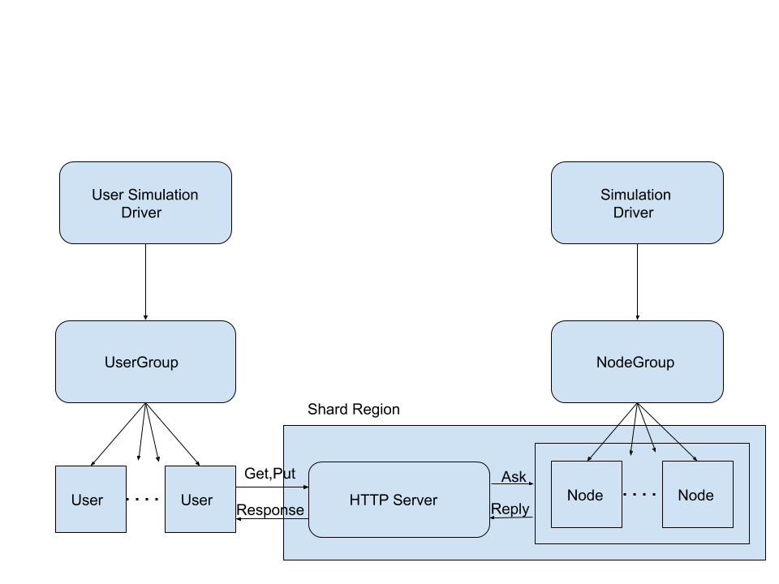

### CS 441 - Project

### Project Details: To create Chord Algorithm using Typed Akka and Akka-HTTP and Cluster Sharding

#### Project Members: (in Alphabetical Order)
* Karan Venkatesh Davanam
* Prajwal Kishor Kammardi
* **Rishabh Mehta** (Lead)
* Shabbir Bohra

#### Development Environment
* Development environment: Windows 10
* Frameworks Akka 2.6.10, Akka-HTTP 10.2.1, Akka-Stream 2.6.10,  MoultingYaml 0.4.2, Akka-Cluster-Sharding-typed 2.6.10, Akka-Management 1.0.9
* IDE Used: IntelliJ IDEA 2020.2.3
* Build Tools: SBT


#### Aim
To implement [**Chord: A Scalable Peer-to-peer Lookup Protocol for Internet Applications**](https://pdos.csail.mit.edu/papers/chord:sigcomm01/chord_sigcomm.pdf)

#### Steps to run
1. Clone the repository [OverlayNetworkSimulator_Group1](https://bitbucket.org/cs441-fall2020/overlaynetworksimulator_group1/) 
`
git clone https://prajwalkk@bitbucket.org/cs441-fall2020/overlaynetworksimulator_group1.git`
1. Make sure to be on the **master** branch
1. Run the following command `sbt clean compile test run`
1. The Simulation will be run by default on `http://localhost:8000`. Make sure the port is open.

#### Features of the Project
1. The Project is fully written in Scala
1. The Project fully makes use of Akka-Typed Behaviors model. It may seem to look like it is OO model, but the Actors are modelled in such a way that the Objects represents Protocols used by the actor and the classes use the functions as Behaviors. This style of separation of concerns was suggested by the [style guide](https://doc.akka.io/docs/akka/current/typed/style-guide.html)
1. The Project uses Akka cluster sharding to shard the Chord nodes.
1. The Project makes full use of the iterative style of the Chord Algorithm specified in the paper with the link above.
1. The data used by the Project is a collection of dialogues as keys and their Shakespeare-an conversion. They contain spaces and are encoded before firing a request or sending a response. 

#### Architecture



#### Code Flow
* The Project is an attempted Monte Carlo simulation of how a P2P distributed system tends to store the data in the network
It involves the following modules
    * Simulation Driver 
        * Main entry point for Node Creation, HTTP Server and Capturing Yaml snapshots
        * Present in the `com.chord.akkasharding` package
    * User Simulation Driver
        * Entry point for user creation
        * Initializing chord data and generate random-lookup and insert
        * The object that contains function to execute the Monte carlo simulation  
        * Collects and collates results by passing messages to NodeGroup Actor 
        * Present in the `com.chord.akkasharding` package  
    * Simulation object
        * Initializes ClusterSharding and AkkaManagement
        * Creates userGroup, NodeGroup, HTTP server actors 
        * Shards the NodeActor Type
        * Present in `com.chord.akkasharding.simulation` package
    * Node Group. 
        * This module is responsible to hold the information about the node actors in the Akka System.
        * This is an Akka Actor System
        * The node group's job is to Create the number of nodes(entities for the shard region) that is specified in the configuration file. 
        * This captures the Node Actors' **snapshot**. Aggregates them and writes them to a file. 
        * present in the `com.chord.akkasharding.actors` package
    * Node Actor
        * Entities present in each Shard.
        * The main Computing component
        * `com.chord.akkasharding.actors` package
        * Each node implements the functions specified in the chord algorithm
        * A node is added to the ring sequentially.
        * While joining the ring, the node's finger table is initialized. If it is the first node, it's successor and predecessor are set to itself
        * A node stores the data it is responsible for, uses fingertable, hashing and the key to decide on that
        * Node Operations. They are either messages or functions. The decisions of choosing them to be messages and functions are elaborated below  
            1. `Join`
                * This is a Fire and Forget message send my the NodeGroup to the node.
                * If the node is the first node, it sets itself as it's successor and predecessor. Else, it executes below: 
                    * Runs the `InitFingerTable` Function
                    * Tells other nodes via `UpdateOthers` to update their entries 
            2.  `init_finger_table`
                * This is a function that is executed by a new node which is not the first node to join. 
                * It gets its successor by `FindSuccessor`. This is a blocking call that waits for a response before continuing
                * Find Successor gets its value by executing `find_predecessor` function: This was made a function rather than a message as it was creating race conditions when a node asked itself.
                * `ClosestPrecedingFinger` is a message asked by the function in `find_predecessor`. Here if, there is a check that sees if same node is asking itself, if so, the node properties are returned directly rather than wasting time asking and awaiting for reply. Also reduces deadlocks.
                * `SetPredecessor` message is called to set the predecessor of the to-be-succeeding-node to the node that sent the message. This message is made blocking to ensure validity of the finger table in the future runs. 
                * The finger table of the node is updated to reflect the successors for entry.
                * Some other auxiliary messages used in this step are `GetPredecessor` ask call to get the predecessor of a node. 
                * the node is restarted with it's updated values  
            3.  `UpdateOthers` it is a tell message that informs the other nodes to update their Finger table to reflect the entries of the callee via the,
            4.  `UpdateFingerTable` is a tell message that tells the node to update its fingertable
            5. `SendSnapshot` `SendDataSnapshot`. These messages are provided to capture the current state of the system. 
    * User Group 
        * Creates user actors and maintains their addresses. 
        * `com.chord.akkasharding.actors` package
    * User Actor
        * It models a user who can:
            1. `lookup_data` Search for the keys to be inserted 
            2. `put_data` Insert data to the system
    * HTTP Server
        * This orchestrates the message from the user to the node component.
        * Set on `localhost:8000` the path are `/chord`
        * The get request for `lookup_data` is like `http://127.0.0.1:8000/chord/<key>`
        * the post request for `put_data` is like `http://127.0.0.1:8000/chord` and a json payload `{"key":"$key","value":"$value"}`
    * Utils
        The Utils package contains classes to perform operations
            * `DataUtils` read_data() of a CSV file
            * `Helper` Contains hashing functions (SHA1), Range Validation function used in the Chord Algorithm.
            * `MyYaml*Protocol` case classes to convert NodeConfigurations to a YAML (YAML Ain't a Markup Language) file.
            * `YamlDump*` case class to model YAML file. The above two are needed to for the MoultingYaml Package
            
#### Execution Sample 


#### Results
* The server addition logs are as below: 

```log
[2020-11-18 18:57:11,959] [INFO] [akka.event.slf4j.Slf4jLogger] [NodeActorSystem-akka.actor.default-dispatcher-3] [] - Slf4jLogger started
[2020-11-18 18:57:12,112] [INFO] [com.chord.akka.actors.NodeGroup$] [NodeActorSystem-akka.actor.default-dispatcher-5] [akka://NodeActorSystem/user] - Creating 5 Nodes
[2020-11-18 18:57:12,142] [INFO] [com.chord.akka.actors.NodeActor] [NodeActorSystem-akka.actor.default-dispatcher-3] [akka://NodeActorSystem/user/Node_0] - [Join] First node Node_0 joining: n: Node_0 with nDash : Node_0
[2020-11-18 18:57:12,144] [INFO] [com.chord.akka.actors.NodeActor] [NodeActorSystem-akka.actor.default-dispatcher-3] [akka://NodeActorSystem/user/Node_0] - [Join] Node_0 Updated node Properties: node :Node_0 
 nodeRef :akka://NodeActorSystem/user/Node_0 
 nodeSuccessor : Node_0 
 nodePredecessor :Node_0,
 nodeFingerTable: 
List(
190 | [190, 191) | Node_0, 
191 | [191, 193) | Node_0, 
193 | [193, 197) | Node_0, 
197 | [197, 205) | Node_0, 
205 | [205, 221) | Node_0, 
221 | [221, 253) | Node_0, 
253 | [253, 61) | Node_0, 
61 | [61, 189) | Node_0)
[2020-11-18 18:57:13,126] [INFO] [com.chord.akka.actors.NodeActor] [NodeActorSystem-akka.actor.default-dispatcher-3] [akka://NodeActorSystem/user/Node_1] - [Join] Node_1 node joining
[2020-11-18 18:57:13,134] [INFO] [com.chord.akka.actors.NodeActor] [NodeActorSystem-akka.actor.default-dispatcher-3] [akka://NodeActorSystem/user/Node_1] - [init_finger_table] Setting predecessor for Node_0 as Node_1  
[2020-11-18 18:57:13,134] [INFO] [com.chord.akka.actors.NodeActor] [NodeActorSystem-akka.actor.default-dispatcher-6] [akka://NodeActorSystem/user/Node_0] - [SetPredecessor] Node_0 New Props to node :Node_0 
 nodeRef :akka://NodeActorSystem/user/Node_0 
 nodeSuccessor : Node_0 
 nodePredecessor :Node_1,
 nodeFingerTable: 
List(
190 | [190, 191) | Node_0, 
191 | [191, 193) | Node_0, 
193 | [193, 197) | Node_0, 
197 | [197, 205) | Node_0, 
205 | [205, 221) | Node_0, 
221 | [221, 253) | Node_0, 
253 | [253, 61) | Node_0, 
61 | [61, 189) | Node_0)
```
* User creation logs are as below:

```log
[2020-11-18 18:57:42,121] [INFO] [com.chord.akka.actors.UserGroup] [UserActorSystem-akka.actor.default-dispatcher-8] [akka://UserActorSystem/user] - Creating 3 Users
[2020-11-18 18:57:42,123] [INFO] [com.chord.akka.actors.UserGroup] [UserActorSystem-akka.actor.default-dispatcher-8] [akka://UserActorSystem/user] - User Created akka://UserActorSystem/user/User_0
[2020-11-18 18:57:42,124] [INFO] [com.chord.akka.actors.UserGroup] [UserActorSystem-akka.actor.default-dispatcher-8] [akka://UserActorSystem/user] - User Created akka://UserActorSystem/user/User_1
[2020-11-18 18:57:42,125] [INFO] [com.chord.akka.actors.UserGroup] [UserActorSystem-akka.actor.default-dispatcher-8] [akka://UserActorSystem/user] - User Created akka://UserActorSystem/user/User_2
[2020-11-18 18:58:03,155] [INFO] [akka.event.slf4j.Slf4jLogger] [AkkaHttpServer-akka.actor.default-dispatcher-3] [] - Slf4jLogger started
``` 
* HTTP: Server Creation and data insertion log:

```log
[2020-11-18 18:58:04,346] [INFO] [akka.actor.typed.ActorSystem] [AkkaHttpServer-akka.actor.default-dispatcher-3] [] - Server online at http://127.0.0.1:8080
[2020-11-18 18:58:07,166] [INFO] [com.chord.akka.SimulationDriver$] [NodeActorSystem-akka.actor.default-dispatcher-5] [] - Getting snapshots
[2020-11-18 18:58:22,145] [INFO] [com.chord.akka.SimulationDriver$] [NodeActorSystem-akka.actor.default-dispatcher-15] [] - Getting snapshots
[2020-11-18 18:58:23,179] [INFO] [com.chord.akka.SimulationDriver$] [main] [] - Inserting 75 records
[2020-11-18 18:58:23,181] [INFO] [com.chord.akka.simulation.Simulation$] [main] [] - Initializing Chord data
[2020-11-18 18:58:23,429] [INFO] [com.chord.akka.actors.NodeActor] [AkkaHttpServer-akka.actor.default-dispatcher-10] [akka://AkkaHttpServer/user/HTTPServer] - [addValue] Data key: You sell fish. ;value: You are a fishmonger. with id 149 stored at Node_0
[2020-11-18 18:58:23,430] [INFO] [com.chord.akka.actors.NodeActor] [AkkaHttpServer-akka.actor.default-dispatcher-10] [akka://AkkaHttpServer/user/HTTPServer] - [addValue] Data key: Of course. ;value: Excellent well. with id 190 stored at Node_3
[2020-11-18 18:58:23,432] [INFO] [com.chord.akka.actors.NodeActor] [AkkaHttpServer-akka.actor.default-dispatcher-10] [akka://AkkaHttpServer/user/HTTPServer] - [addValue] Data key: No, not me, sir. ;value: Not I, my lord. with id 176 stored at Node_0
[2020-11-18 18:58:23,532] [INFO] [com.chord.akka.actors.NodeActor] [AkkaHttpServer-akka.actor.default-dispatcher-16] [akka://AkkaHttpServer/user/HTTPServer] - [addValue] Data key: In that case I wish you were as good a man as a fish seller. ;value: Then I would you were so honest a man. with id 241 stored at Node_1
[2020-11-18 18:58:23,643] [INFO] [com.chord.akka.actors.NodeActor] [AkkaHttpServer-akka.actor.default-dispatcher-18] [akka://AkkaHttpServer/user/HTTPServer] - [addValue] Data key: Good, sir? ;value: Honest, my lord? with id 188 stored at Node_0
[2020-11-18 18:58:23,753] [INFO] [com.chord.akka.actors.NodeActor] [AkkaHttpServer-akka.actor.default-dispatcher-16] [akka://AkkaHttpServer/user/HTTPServer] - [addValue] Data key: Yes, sir. ;value: Ay, sir. with id 226 stored at Node_3
[2020-11-18 18:58:23,864] [INFO] [com.chord.akka.actors.NodeActor] [AkkaHttpServer-akka.actor.default-dispatcher-18] [akka://AkkaHttpServer/user/HTTPServer] - [addValue] Data key: Only one man in ten thousand is good in this world. ;value: To be honest, as this world goes, is to be one man picked out of ten thousand. with id 228 stored at Node_3
[2020-11-18 18:58:23,976] [INFO] [com.chord.akka.actors.NodeActor] [AkkaHttpServer-akka.actor.default-dispatcher-16] [akka://AkkaHttpServer/user/HTTPServer] - [addValue] Data key: That’s definitely true, my lord. ;value: That’s very true, my lord. with id 41 stored at Node_2
[2020-11-18 18:58:24,086] [INFO] [com.chord.akka.actors.NodeActor] [AkkaHttpServer-akka.actor.default-dispatcher-18] [akka://AkkaHttpServer/user/HTTPServer] - [addValue] Data key: Since if the sun breeds maggots on a dead dog, kissing the corpse—by the way, do you have a daughter? ;value: For if the sun breed maggots in a dead dog, being a good kissing carrion— Have you a daughter? with id 125 stored at Node_0
[2020-11-18 18:58:24,198] [INFO] [com.chord.akka.actors.NodeActor] [AkkaHttpServer-akka.actor.default-dispatcher-16] [akka://AkkaHttpServer/user/HTTPServer] - [addValue] Data key: I do indeed, my lord. ;value: I have, my lord. with id 100 stored at Node_0
[2020-11-18 18:58:24,311] [INFO] [com.chord.akka.actors.NodeActor] [AkkaHttpServer-akka.actor.default-dispatcher-18] [akka://AkkaHttpServer/user/HTTPServer] - [addValue] Data key: Then by all means never let her walk in public. ;value: Let her not walk i' th' sun. with id 60 stored at Node_4
[2020-11-18 18:58:24,371] [INFO] [com.chord.akka.simulation.Simulation$] [main] [] - Finished Init data

```

* Http Lookup log

```log
[2020-11-18 18:58:24,371] [INFO] [com.chord.akka.SimulationDriver$] [main] [] - Starting look ups on initialized data
[2020-11-18 18:58:24,371] [INFO] [com.chord.akka.simulation.Simulation$] [main] [] - Read Requests started
[2020-11-18 18:58:24,379] [INFO] [com.chord.akka.actors.NodeActor] [AkkaHttpServer-akka.actor.default-dispatcher-16] [akka://AkkaHttpServer/user/HTTPServer] - [getValue]  Data found at Node_3 key: Of+course. ; value : Excellent well. 
[2020-11-18 18:58:24,422] [INFO] [com.chord.akka.actors.NodeActor] [AkkaHttpServer-akka.actor.default-dispatcher-16] [akka://AkkaHttpServer/user/HTTPServer] - [addValue] Data key: Procreation is a good thing, but if your daughter gets pregnant … look out, friend. ;value: Conception is a blessing, but, as your daughter may conceive—Friend, look to ’t. with id 122 stored at Node_0
[2020-11-18 18:58:24,486] [INFO] [com.chord.akka.actors.NodeActor] [AkkaHttpServer-akka.actor.default-dispatcher-16] [akka://AkkaHttpServer/user/HTTPServer] - [getValue]  Data found at Node_0 key: You+sell+fish. ; value : You are a fishmonger. 
[2020-11-18 18:58:24,535] [INFO] [com.chord.akka.actors.NodeActor] [AkkaHttpServer-akka.actor.default-dispatcher-10] [akka://AkkaHttpServer/user/HTTPServer] - [addValue] Data key: A lot of words. ;value: Words, words, words. with id 163 stored at Node_0
[2020-11-18 18:58:24,596] [INFO] [com.chord.akka.actors.NodeActor] [AkkaHttpServer-akka.actor.default-dispatcher-10] [akka://AkkaHttpServer/user/HTTPServer] - [getValue]  Data found at Node_0 key: No,+not+me,+sir. ; value : Not I, my lord. 
[2020-11-18 18:58:24,644] [INFO] [com.chord.akka.actors.NodeActor] [AkkaHttpServer-akka.actor.default-dispatcher-10] [akka://AkkaHttpServer/user/HTTPServer] - [addValue] Data key: And what is the subject? ;value: What is the matter, my lord? with id 57 stored at Node_4
[2020-11-18 18:58:24,705] [INFO] [com.chord.akka.actors.NodeActor] [AkkaHttpServer-akka.actor.default-dispatcher-10] [akka://AkkaHttpServer/user/HTTPServer] - [getValue]  Data found at Node_1 key: In+that+case+I+wish+you+were+as+good+a+man+as+a+fish+seller. ; value : Then I would you were so honest a man. 
[2020-11-18 18:58:24,752] [INFO] [com.chord.akka.actors.NodeActor] [AkkaHttpServer-akka.actor.default-dispatcher-10] [akka://AkkaHttpServer/user/HTTPServer] - [addValue] Data key: Between whom? ;value: Between who? with id 155 stored at Node_0
```

* There are 2 YAML dumps. One signifying the Node state, the other Data in the nodes. They look like the below examples
    *   Single node example for Node YAML and Data YAML
    
```yaml
ArrivaltimeStamp: '2020-11-18T19:07:26.376829600'
NodeProps:
  node_name: Node_0
  nodeRef: Node_0
  timestamp: '2020-11-18T19:07:26.374793400'
  nodeSuccessor: Node_3
  nodePredecessor: Node_4
  nodeFingerTable:
  - start: '190'
    interval:
    - 190
    - 191
    succ: Node_3
  - start: '191'
    interval:
    - 191
    - 193
    succ: Node_3
  - start: '193'
    interval:
    - 193
    - 197
    succ: Node_3
  - start: '197'
    interval:
    - 197
    - 205
    succ: Node_3
  - start: '205'
    interval:
    - 205
    - 221
    succ: Node_3
  - start: '221'
    interval:
    - 221
    - 253
    succ: Node_3
  - start: '253'
    interval:
    - 253
    - 61
    succ: Node_1
  - start: '61'
    interval:
    - 61
    - 189
    succ: Node_4
  nodeID: 189
```

```yaml
nodeName: Node_0
size: 37
keys:
- 130
- 131
- 132
- 139
- 140
- 141
- 78
- 81
- 145
- 147
- 84
- 149
- 151
- 91
- 155
- 158
- 99
- 163
- 100
- 164
- 168
- 171
- 108
- 112
- 176
- 177
- 115
- 179
- 116
- 117
- 181
- 118
- 120
- 122
- 187
- 188
- 125
```

#### Future Improvements
  
* The Program does not scale well beyond 256 nodes. Therefore we have limited the max nodes to be 256 ie 2^8 or m = 8
* The Application was not performance tested. Hence, we have added a lot of timeouts between each line of code to add a small delay between each HTTP requests from the user. The application behaves poorly with rapid bursts (spike testing) or with heavy load for a large amount of time(Stress testing)
* The snapshot capturing technique is pretty simple and there is no control given to the user to take snapshot. The actors are not paused while capturing, rather, a 30s delay is added. 
  
